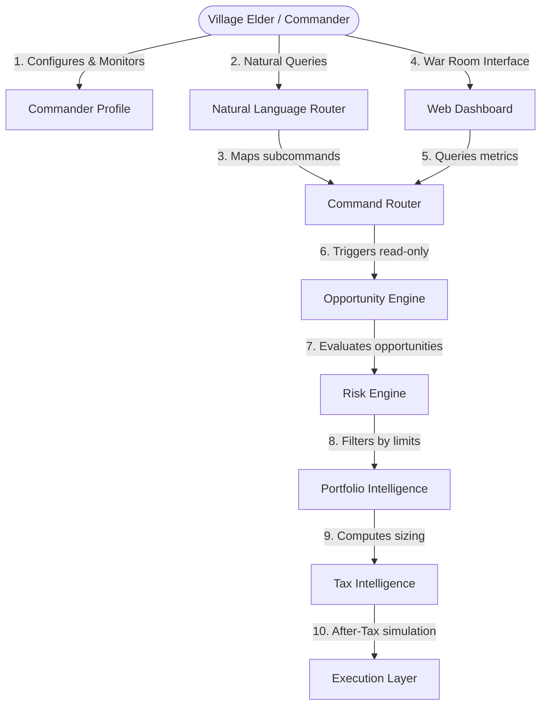

# Hokage System Architecture Map

This document presents a one-page architectural map of Hokage, tracing the flow from the user interface down to execution and showing active doctrines, asset coverage, and the future roadmap.

---

## 1. Architectural Map Flow



### Flow Components & Responsibilities

*   **Elder**: The Village Commander (**Anant**), who monitors operations and queries system states without code exposure.
*   **Commander Profile**: Loaded from `config/commander_profile.json` as the **Single Source of Truth** for titles, names, risk modes, and progression configurations. Enforces strict type-safe enums (`HorizonMode`, `RiskMode`, `ExecutionMode`, `ProgressionPhase`).
*   **Natural Language Router**: Parses conversational sentences from the Commander using heuristics to map them to backend command strings.
*   **Command Router**: Parses and dispatches Hokage CLI commands to the orchestrator pipeline.
*   **Dashboard**: A mobile-friendly browser interface (Commander War Room) displaying portfolio status cards, opportunities, and tax simulated metrics.
*   **Opportunity Engine**: Asset-agnostic scanners and opportunity score rankers queryable across all asset classes.
*   **Risk Engine**: Enforces pre-entry stops, exposure limits, consecutive-loss cooldown periods, and maximum portfolio drawdown safety caps.
*   **Portfolio Intelligence**: Scales positions based on regime volatility (VIX delta), sizer calculations, and sector limits.
*   **Tax Intelligence**: Evaluates simulated paper tax liabilities and realized live tax ledgers (STCG, LTCG, flat 30% crypto tax, dividend taxes).
*   **Execution Layer**: Bridges operations to `PaperVenue` (simulated paper-trading) or `KiteVenue` (production live broker), currently operating under strict `READ_ONLY` safety gates.

---

## 2. Active Doctrines

> [!IMPORTANT]
> **The Prime Directive**
> *"Find the highest risk-adjusted opportunity available anywhere within the approved investment universe."*

*   **Single Source of Truth**: All configuration variables must derive directly from the Commander Profile. No hardcoding of names, titles, risk modes, or active portfolios is permitted.
*   **After-Tax Focus**: Hokage optimizes after-tax risk-adjusted returns, not merely pre-tax returns.
*   **Strict Read-Only Execution Boundary**: In Phase 5B, no write-actions, order placements, or parameter overrides are permitted via command interfaces.

---

## 3. Asset Coverage

Hokage treats all asset classes as first-class citizens under a unified asset abstraction layer:
1.  **Equities**: Indian blue-chip stocks (e.g. TCS, Reliance) and broad index tracking (e.g. Bank Nifty).
2.  **Commodities**: Energy spot contracts (Crude Oil) and precious metals (Gold, Silver).
3.  **Forex**: Major currency translation pairs (e.g. USD/INR).
4.  **Crypto**: Major digital assets (BTC, ETH).

---

## 4. Current Completed Phases

*   **Phase 1-3**: Core framework, data ingestion, and Kite broker connectivity.
*   **Phase 4A-4B**: Backtesting engine, simulated price generation, and paper-trading venues.
*   **Phase 4C.5**: Capital preservation gates, exposed audit decision logs, and rolling metrics.
*   **Phase 4C.5E**: Institutional knowledge ingestion (6 classic trading playbooks integrated).
*   **Phase 5A.2**: Read-Only Command CLI (`hokage status`, `positions`, `portfolio`, `why <symbol>`, etc.).
*   **Phase 5A.3**: Browser Dashboard (Commander War Room), Conversational chat router, and Tax Intelligence schemas.
*   **Phase 5B**: Commander Profile configuration layer (`commander_profile.json` integration, enums refactoring).

---

## 5. Future Roadmap

```text
Alpha (Current) ──> Beta ──> Gamma ──> Delta ──> Omega
```
*   **Phase Beta (3-7 assets)**: Focused/Tactical Mode. Adds blue-chips, gold, crude, BTC, ETH, and USD/INR.
*   **Phase Gamma (25-100 assets)**: Expanded Mode. Adds sector leaders, mid-caps, top 10 cryptos, index futures.
*   **Phase Delta (Entire Market)**: National Market Mode. Full NSE Nifty 500 coverage.
*   **Phase Omega (Global cross-asset)**: Global Mode. Complete global equities, commodities, forex, crypto, ETFs, bonds, REITs.
