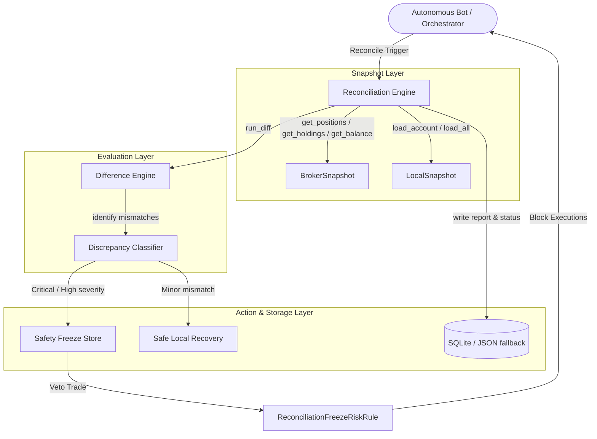

# Broker Reconciliation Engine Walkthrough

This document details the design, architecture, implementation, and verification of Sprint 2 — Broker Reconciliation Engine in Hokage.

---

## 1. Architecture Overview

The Broker Reconciliation Engine guarantees that Hokage's internal states (portfolio ledger, open position tracker, and execution journal) always match the broker's actual state (positions, holdings, open/completed orders, and cash balances). 

To preserve capital and ensure absolute safety, the system implements a **multi-dimensional Difference Engine** and **Discrepancy Classifier** acting as a safety gating layer:

### Architectural Components:
1. **Reconciliation Engine (`ReconciliationEngine`)**: Coordinates the execution, fetches snapshots, runs comparison diffing, logs alerts, invokes recovery, and saves the session report and status.
2. **Snapshots (`BrokerSnapshot` & `LocalSnapshot`)**: Agnostic data structures capturing a point-in-time state of the broker (total equity, cash, positions, holdings, orders) and local database (account, positions, trades, decisions).
3. **Difference Engine (`DifferenceEngine`)**: Executes structured comparisons across balances, positions, holdings, and orders, identifying mismatches (such as quantity, average price, or status) and internal ledger inconsistencies.
4. **Discrepancy Classifier (`DiscrepancyClassifier`)**: Classifies the identified mismatches into specific discrepancy types, assigns severities (`LOW`, `MEDIUM`, `HIGH`, `CRITICAL`), estimates financial/operational risk, and flags whether a strategy/asset freeze is required.
5. **Reconciliation Store (`ReconciliationStore`)**: Handles transactional persistence of freezes, historical reports, and real-time status summaries. Fully supports Phase 6.1 ACID SQLite tables with seamless fallback to local JSON files if SQLite is inactive (ensuring 100% backward compatibility for legacy test runs).
6. **Reconciliation Freeze Risk Rule (`ReconciliationFreezeRiskRule`)**: A gating risk rule registered inside the `CompositeRiskManager` that checks if an asset is frozen. If frozen, it immediately vetos any new order proposals, preserving capital.

---

## 2. Discrepancy Classification & Severity Matrix

The `DiscrepancyClassifier` evaluates mismatches based on risk exposure:

| Discrepancy Type | Severity | Requires Freeze | Risk Description | Auto-Recovery Action |
| :--- | :--- | :--- | :--- | :--- |
| `PHANTOM_POSITION` | **CRITICAL** | **Yes** | Broker has an open position that local ledger is unaware of. High risk of unmanaged financial exposure. | **State Re-sync**: Reconstructs the position locally so exit/risk bots can manage it. |
| `DUPLICATE_POSITION` | **CRITICAL** | **Yes** | Multiple open positions found where only one is expected. Risk of over-exposure. | Requires manual intervention. |
| `QUANTITY_MISMATCH` (Broker > Local) | **CRITICAL** | **Yes** | Broker has higher exposure than local ledger. Unmanaged market risk. | **Local Cache Refresh**: Updates local quantity to match the broker. |
| `QUANTITY_MISMATCH` (Broker < Local) | **HIGH** | **Yes** | Local ledger expects higher exposure than broker. Risk of unrecorded manual exits or partial fills. | **Local Cache Refresh**: Updates local quantity to match the broker. |
| `MISSING_POSITION` | **HIGH** | **Yes** | Local ledger expects an open position but it is missing on the broker. Exit orders will fail. | **State Re-sync**: Marks the local position as `CLOSED`. |
| `PRICE_MISMATCH` (> 5%) | **HIGH** | **Yes** | Large deviation in average entry price. Distorts stop-loss and take-profit triggers. | **Local Cache Refresh**: Updates local entry price to match the broker. |
| `PRICE_MISMATCH` (1% - 5%) | **MEDIUM** | **No** | Moderate price deviation. Leads to minor performance tracking skew. | **Local Cache Refresh**: Updates local entry price to match the broker. |
| `REJECTED_ORDER` | **HIGH** | **No** | Missed execution on broker due to rejection (e.g., margins, limits). | Logs alert for Village Elder review. |
| `PARTIAL_FILL` | **MEDIUM** | **No** | Order partially executed on the broker. | Monitored; re-syncs on order completion. |
| `STATUS_MISMATCH` | **MEDIUM** | **No** | Position or order status mismatch between local and broker. | Re-syncs local status. |
| `ORPHANED_TRADE` | **HIGH** | **No** | Local trade record exists with no corresponding broker order or open position. | Logs warning; requires manual audit. |
| `LEDGER_INCONSISTENCY` | **HIGH** | **Yes** | Local portfolio equity/cash calculations are mathematically inconsistent. | **State Re-sync**: Aligns local cash/equity with broker cash. |

---

## 3. Recovery and Safety Rules

Hokage operates under strict safety doctrines:
1. **Never modify broker state automatically**: Reconciliation will *never* place, modify, or cancel orders on the broker.
2. **Never assume the broker or local database is correct**: Mismatches are flagged, risk is estimated, affected strategies are frozen, and the Village Elder (system log/report) is notified.
3. **Safe automatic recovery is restricted to local systems**: Automated recovery is only permitted for local cache refreshes, local state re-syncs, and missing metadata reconstructions.

If an asset is frozen, the `ReconciliationFreezeRiskRule` blocks all new orders for it until a re-sync resolves the discrepancy or the Village Elder issues an unfreeze approval.

---

## 4. CLI and Dashboard APIs

### CLI Commands:
* `hokage reconcile`: Runs reconciliation, performs safe local re-syncs, and prints a high-level summary.
* `hokage reconcile --report`: Runs reconciliation and outputs the full, detailed textual briefing.
* `hokage reconcile --health`: Prints only the current system health score (e.g. `System Health Score: 98.0/100 (ATTENTION)`).
* `hokage reconcile --asset SYMBOL`: Runs reconciliation filtered specifically for the given asset symbol.

### Dashboard REST APIs (Flask):
* `GET /api/v1/reconciliation/status`: Returns a JSON summary of the latest health score, last reconciliation time, outstanding discrepancies count, and critical alerts.
* `GET /api/v1/reconciliation/reports`: Returns a JSON list of all historical reconciliation reports (newest first).
* `POST /api/v1/reconciliation/run`: Manually triggers a fresh reconciliation run and returns the report.

---

## 5. Files Added and Modified

### New Files Added:
* `src/shared/reconciliation/snapshot.py` (Defines `BrokerSnapshot` and `LocalSnapshot` capturing structures).
* `src/shared/reconciliation/classifier.py` (Defines `Discrepancy` model, discrepancy types, severities, and risk classifier).
* `src/shared/reconciliation/difference.py` (Implements `DifferenceEngine` multi-dimensional comparison logic).
* `src/shared/reconciliation/report.py` (Implements `ReconciliationReport` and health score calculation).
* `src/shared/reconciliation/store.py` (Implements SQL-and-JSON-fallback persistence for freezes, reports, and status).
* `src/shared/reconciliation/engine.py` (Implements `ReconciliationEngine` coordinator and safe auto-recoveries).
* `src/shared/reconciliation/__init__.py` (Exposes package-level public interfaces).
* `tests/unit/shared/reconciliation/test_reconciliation.py` (Comprehensive test suite covering 15 distinct verification scenarios).

### Existing Files Modified:
* `src/shared/persistence/sqlite_engine.py` (Added DDL schemas for tables 15, 16, and 17: `reconciliation_freezes`, `reconciliation_reports`, and `reconciliation_status`).
* `src/bots/risk/rules.py` (Added `ReconciliationFreezeRiskRule` class).
* `src/hokage/orchestrator/pipeline.py` (Registered `ReconciliationFreezeRiskRule` inside risk bot, and added `run_reconciliation` orchestrator method).
* `src/hokage/router/command_router.py` (Added CLI command routes and arguments parsing for `reconcile`, `--report`, `--health`, and `--asset`).
* `src/hokage/dashboard/api.py` (Added Flask API routes for `/status`, `/reports`, and `/run` under `/reconciliation`).

---

## 6. Verification and Testing Summary

The entire suite of 15 comprehensive verification test cases covers:
1. `test_perfect_alignment`: Perfect match results in health score 100 and no freezes.
2. `test_phantom_position_detection_and_recovery`: Phantom position correctly flagged as `CRITICAL`, triggers safety freeze, and is safely re-synced locally (reconstructing metadata).
3. `test_missing_position_detection_and_recovery`: Missing broker position flagged as `HIGH`, triggers safety freeze, and is safely closed locally (netting ledger).
4. `test_quantity_mismatch_severities_and_recovery`: Mismatch flagged (CRITICAL if broker > local, HIGH if broker < local), and successfully recovered locally.
5. `test_price_mismatch_thresholds`: Small mismatch (< 1%) flagged as LOW (no freeze), large mismatch (> 5%) flagged as HIGH (freezes asset).
6. `test_stale_local_cache_balance_resync`: Local cash balance discrepancy resolved by aligning to broker balance.
7. `test_reconciliation_freeze_risk_rule`: Verifies that a frozen asset is immediately blocked from execution by risk gating.
8. `test_network_interruption_graceful_handling`: Gratefully handles connection timeouts without crashing, flagging it as a ledger inconsistency.
9. `test_recovery_after_restart_persistence`: Mismatches and freezes persist correctly across engine restarts.
10. `test_race_conditions_concurrency`: Verifies thread-local write safety of the reconciliation store under high parallel loads.
11. `test_stress_test_large_portfolio`: Verifies performance with 150+ positions, executing the entire diff and classification in under 200 ms.
