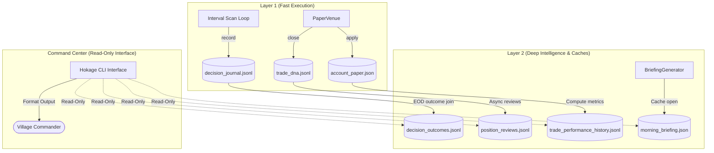

# Hokage Command Center Requirements Report
## Phase 5A.1 — Commander-Facing Interface Audit & Requirements

This document establishes the architecture, data sources, command structure, and implementation phases for the HOKAGE Command Center, enabling Elder Anant (the Village Commander) to monitor and query Hokage's state without direct exposure to code, logs, or JSON stores.

---

## 1. Inventory of Data Sources (Task 1)

The Command Center will aggregate and present data from the following read-only source files:

| Data Source | Owner Engine | Update Frequency | Commander Value | Read-Only Suitability |
| :--- | :--- | :--- | :--- | :--- |
| **`account_paper.json`** | `PortfolioBot` | Per execution/exit | Current account balances, cash available, open position details | High (JSON formatted) |
| **`decision_journal.jsonl`** | `DecisionJournalSystem` | Per opportunity scan | Audits all accepted and rejected trade ideas with 7-gate IC chains | High (Append-only JSONL) |
| **`decision_outcomes.jsonl`** | `DecisionJournalSystem` | Per position exit | Audits actual results (realized PnL, exit reasons) linked by `decision_id` | High (Append-only JSONL) |
| **`trade_performance_history.jsonl`** | `PerformanceAnalytics` | EOD close / Per exit | Tracks rolling win rate, Sharpe ratio, profit factor, drawdown metrics | High (Append-only JSONL) |
| **`position_reviews.jsonl`** | `PositionReviewEngine` | Asynchronously post-exit | Post-exit quality grades (entry, exit, size, stop) and structured lessons | High (Append-only JSONL) |
| **`trade_dna.jsonl`** | `TradeDNAEngine` | Asynchronously post-exit | Closed trade DNA fingerprints queryable by regime, sector, and grade | High (Append-only JSONL) |
| **`market_snapshot.json`** | `MarketScanner` | Pre-market open | Cached morning index prices (Nifty, BankNifty, USDINR, Crude, Gold) | High (JSON formatted) |
| **`morning_briefing.json`** | `BriefingGenerator` | Pre-market open | Cached morning intelligence briefing output | High (JSON formatted) |

---

## 2. Commander Question Audit (Task 2)

The Commander must be able to resolve questions across the following six categories:

### STATUS
*   Is Hokage running? What is the current cycle latency?
*   What is our available cash and total portfolio value in INR?
*   What is the active risk mode (`BALANCED`, `DEFENSIVE`, `RECOVERY`) and Elder Trust score?
*   Are there any open positions?

### TRADING
*   What trades did Hokage take today? What are the active stop-loss and take-profit targets?
*   Why was a specific opportunity entered (`decision_id` routing)?
*   Why was a specific trade rejected (which gate vetoed it and what was the reason)?
*   Show me today's accepted vs. rejected decisions.

### PERFORMANCE
*   What is today's PnL? What is the weekly net return?
*   What is the current Sharpe ratio, expectancy, and profit factor?
*   What is the maximum peak-to-trough drawdown experienced during the Alpha phase?

### INTELLIGENCE
*   What are the best opportunities scanned today?
*   What are the highest-conviction ideas in the watchlists?
*   What is our current sector exposure (e.g., IT vs. Banking)? Is it approaching the $25\%$ limit?
*   What is the aggregate Portfolio Health Score?

### LEARNING
*   What are the three most recent lessons generated by the quality engine?
*   What is our win rate for trades categorized under "Bear Trending" vs. "Sideways" DNA?
*   What are the biggest execution compliance mistakes (grades $< 70$)?

### KNOWLEDGE
*   What does Benjamin Graham's module say about the PE/PB limit?
*   What specific rules or doctrines from *Trading in the Zone* are currently active in our sizers?
*   Which books or playbooks influenced a specific decision?

---

## 3. Command Taxonomy (Task 3)

The Command Center will parse and support the following commands:

*   **`hokage status`**
    *   *Output:* Displays system state, active personality mode, Elder Trust score, and system run status.
*   **`hokage portfolio`**
    *   *Output:* Displays equity, cash, currency (INR), realized PnL, and maximum drawdown.
*   **`hokage positions`**
    *   *Output:* Displays a table of all open positions: Symbol, Direction, Quantity, Entry Price, Current Price, and Unrealized PnL.
*   **`hokage decisions today`**
    *   *Output:* Displays all opportunities processed today, grouped by accepted vs. rejected status, with conviction scores.
*   **`hokage why <symbol>`**
    *   *Output:* Displays the reasoning chain of the last processed decision for that symbol, detailing which IC gates passed or failed.
*   **`hokage performance`**
    *   *Output:* Displays Sharpe ratio, profit factor, expectancy, weekly return, and rolling win rate.
*   **`hokage lessons`**
    *   *Output:* Displays the last 5 lessons generated by the Position Review Engine.
*   **`hokage dna`**
    *   *Output:* Displays a summary of win rate and average return grouped by market regime and sector DNA.
*   **`hokage briefing`**
    *   *Output:* Displays the cached Morning Briefing in human-readable console format.
*   **`hokage review`**
    *   *Output:* Prompts for daily/weekly templates, auto-populating fields using actual performance ledger metrics.

---

## 4. Data Flow Diagram

---

## 5. Build Phases & Recommended Build Order (Task 4)

### Phase 5A.1: Command Center Audit (Current)
*   **Scope:** Audit data structures, catalog commander queries, and establish command taxonomy.
*   **Dependencies:** Complete Phase 4C.5E (Knowledge Ingestion).
*   **Complexity:** Low (Requirements gathering and architecture validation).
*   **Architectural Impact:** Zero (No code modifications).

### Phase 5A.2: Read-Only Command CLI Interface
*   **Scope:** Build command parsers for CLI commands (`hokage status`, `portfolio`, etc.). Parse JSON and JSONL stores without write side-effects.
*   **Dependencies:** Phase 5A.1 Audit clearance.
*   **Complexity:** Medium (Log parser formatting).
*   **Architectural Impact:** Low (New interface wrapper, completely isolated from active bots).

### Phase 5A.3: Command Dashboard Layer
*   **Scope:** Expose CLI queries via read-only Flask REST API endpoints and create a web-based dashboard UI.
*   **Dependencies:** Phase 5A.2 CLI wrapper.
*   **Complexity:** Medium (REST interface development).
*   **Architectural Impact:** Low (Dashboard services run on separate ports/threads, strictly read-only).

### Phase 5A.4: Telegram Notification Bot
*   **Scope:** Wire EOD summaries, briefings, and alert triggers (e.g., drawdown breach warnings) to Telegram API.
*   **Dependencies:** Phase 5A.3 REST endpoints.
*   **Complexity:** Medium (Webhook/Polling bot integrations).
*   **Architectural Impact:** Low (External notifier daemon).

### Phase 5A.5: Interactive Commander Mode
*   **Scope:** Allow the Commander to toggle risk modes (`BALANCED` to `DEFENSIVE`), adjust starting capital parameters, or manually trigger cooldowns.
*   **Dependencies:** Phase 5A.4 notifications.
*   **Complexity:** High (Secure write interfaces with safety overrides).
*   **Architectural Impact:** High (Introduces controlled external inputs to the Investment Committee).

---

## 6. Architecture safety Verification (Task 5)

*   **Capital Preservation Supremacy:** **CONFIRMED**. The `CapitalPreservationEngine` remains the highest authority. The Command Center cannot bypass drawdown caps or streak scaling rules.
*   **RiskBot Unbypassability:** **CONFIRMED**. Position monitoring and stop-loss exits are managed by the compiled `RiskBot` loop; the Command Center wrapper is read-only and cannot alter stop-loss executions.
*   **Layer 1 / Layer 2 Decoupling:** **CONFIRMED**. The Command Center reads exclusively from cached JSON files and append-only JSONL ledgers. It never blocks or polls active Layer 1 trading execution loops.
*   **Go/No-Go Default Mode:** **CONFIRMED**. Paper trading remains default. Live trading connection connect manager remains locked in `READ_ONLY` mode.
