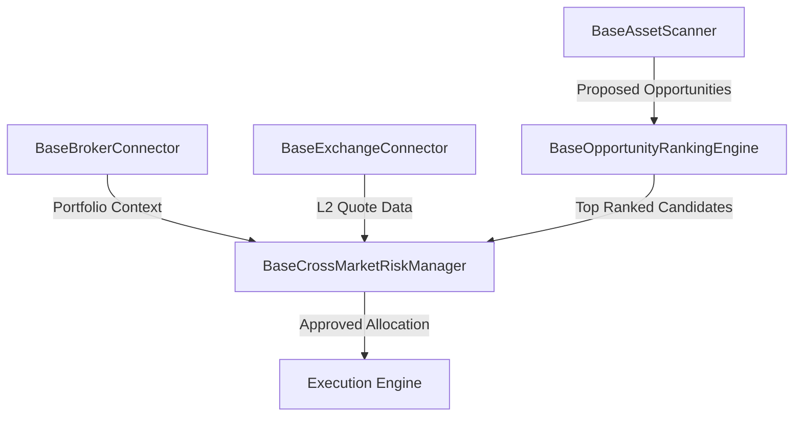

# Global Opportunity Discovery Engine Architecture (Roadmap Doctrine)

This document establishes the architecture, doctrine, and evolution roadmap for transitioning Hokage from a watchlist-based scanner into a comprehensive **Global Opportunity Discovery Engine**.

---

## 1. Core Vision & Doctrine

> [!IMPORTANT]
> **The Prime Directive**
> *"Find the highest risk-adjusted opportunity available anywhere within the approved investment universe."*

Hokage is fundamentally designed to be **asset-agnostic** and **market-agnostic**. Under this doctrine, **Equities, Commodities, Forex, and Crypto** are treated as first-class citizens in a unified asset abstraction layer. The commander is able to query the system with a single question: *"Where is the best opportunity in my approved universe today?"* and receive a ranked comparison across stocks, gold, oil, currencies, and digital assets.

---

## 2. Investment Universe & Market Coverage

Ultimately, the engine will ingest and scan the following market domains:

```text
Global Opportunity Discovery Universe
├── Indian Markets
│   ├── NSE Equities (Entire Nifty 500, Large, Mid, Smallcaps)
│   ├── BSE Equities (Sector Leaders)
│   └── Bonds & Fixed Income (G-Sec, corporate debt)
├── Global Markets
│   ├── US Equities (Nasdaq, S&P 500)
│   └── Global Indices (Nikkei, FTSE, DAX)
├── Alternative Assets
│   ├── Commodities (Gold, Silver, Brent Oil)
│   ├── Currency Markets (Forex spots)
│   └── Crypto Assets & Digital Asset Markets (BTC, ETH, etc.)
└── Intelligence Layers
    ├── ETFs & REITs
    ├── Mutual Fund Portfolio Intelligence (asset-holdings tracking)
    ├── Macro-economic Indicators (yield curves, CPI, interest rates)
    └── News & Sentiment Analysis (geopolitical and capital flow indicators)
```

---

## 3. Horizon Expansion Doctrine

The progression path of Hokage's opportunity discovery universe is strictly controlled to ensure controlled expansion while preserving decision quality:

*   **Phase Alpha**: 1 Asset (Controlled pilot testing, e.g. Crude Oil)
*   **Phase Beta**: 3-7 Assets (Tactical basket tracking)
*   **Phase Gamma**: 25-100 Assets (Extended universe scanning)
*   **Phase Delta**: Entire Market (Full national exchange/venue coverage)
*   **Phase Omega**: Global Multi-Asset Opportunity Discovery (True global cross-asset discovery)

| Progression Phase | Horizon Mode | Universe Size Target | Asset Scope & Authorized Categories |
| :--- | :--- | :--- | :--- |
| **Phase Alpha** (Current) | **FOCUSED** | 1 Asset (e.g. Crude Oil) | Select single Equities/Commodities/Crypto asset |
| **Phase Beta** | **TACTICAL** | 3-7 Assets | Selected blue-chips, gold, crude, BTC, ETH, USDINR |
| **Phase Gamma** | **EXPANDED** | 25-100 Assets | Sector leaders, mid-caps, top 10 cryptos, index futures |
| **Phase Delta** | **MARKET** | Entire National Markets | Full NSE Nifty 500, national commodity baskets |
| **Phase Omega** | **GLOBAL** | Global Multi-Asset | Equities, Commodities, Forex, Crypto, ETFs, Bonds, REITs, Indices |

### 3.1 Authorized Horizon Modes & Asset Scopes

*   **FOCUSED MODE**:
    *   Crude Oil (Commodity)
    *   Gold (Commodity)
    *   BTC (Crypto)
    *   ETH (Crypto)
    *   Bank Nifty (Equity)
*   **TACTICAL MODE**:
    *   Gold (Commodity)
    *   Silver (Commodity)
    *   Crude (Commodity)
    *   BTC (Crypto)
    *   ETH (Crypto)
    *   USDINR (Forex)
    *   Bank Nifty (Equity)
*   **GLOBAL MODE**:
    *   Equities (Stocks & Indices)
    *   Commodities (Energy, Metals, Ags)
    *   Forex (Major currency pairs)
    *   Crypto (Digital assets)
    *   ETFs (Index track products)
    *   Bonds & Fixed Income
    *   REITs (Real estate trusts)
    *   Global Indices (S&P 500, Nasdaq, Nikkei, FTSE)

---

## 4. Core Architectural Components

To achieve this vision, the system defines five primary components, represented by code templates under [src/shared/discovery/](file:///c:/Users/anant/OneDrive/Documents/AI%20PROJECT/AI%20COMMAND%20CENTRE/Hokage/src/shared/discovery/):



### 4.1 Asset-Agnostic Scanners (`BaseAssetScanner`)
*   *Purpose*: Implement domain-specific scanning workers that run concurrently.
*   *Heuristics*: Rather than hardcoding indicators per asset, scanners evaluate volatility normalized profiles, momentum rotations, and value metrics to map assets to a unified [Opportunity](file:///c:/Users/anant/OneDrive/Documents/AI%20PROJECT/AI%20COMMAND%20CENTRE/Hokage/src/shared/discovery/models.py) schema.

### 4.2 Multi-Broker & Multi-Exchange Connectivity (`BaseBrokerConnector` / `BaseExchangeConnector`)
*   *Purpose*: Support connections to multiple API providers (e.g. Zerodha, Interactive Brokers, Binance) and order execution books (NSE, BSE, NYSE, CME).
*   *Unified Portfolio View*: Aggregates diverse sub-accounts into a single consolidated portfolio ledger, providing real-time cash, margin usage, and asset distribution tracking.

### 4.3 Cross-Market Risk Management (`BaseCrossMarketRiskManager`)
*   *Purpose*: Manage holistic portfolio limits across asset classes.
*   *Capabilities*:
    *   **Currency Translation & Exposure Tracking**: Dynamically translate all asset valuations to base currency (INR) and evaluate exchange rate translation risks.
    *   **Global Margin Guard**: Check leverage, global drawdown limits, and margin requirements across brokers to prevent margin calls.
    *   **Correlation & Exposure Caps**: Restrict allocations if a newly discovered opportunity increases correlation risks (e.g. over-exposure to US tech via both US stocks and global ETFs).

### 4.4 Opportunity Ranking Engine (`BaseOpportunityRankingEngine`)
*   *Purpose*: Filter and rank heterogeneous opportunities.
*   *Mechanism*: Uses multi-criteria scoring to evaluate:
    1.  **Conviction Score**: (0-100 grade based on backtests, sentiment, and playbooks).
    2.  **Expected Risk-Reward Ratio (R:R)**: Profit potential versus stop distance.
    3.  **Capital Flow Index**: Sector rotation strength.
    4.  **Macro Match**: Synergy with the current global regime (e.g. favoring gold during high-inflation regimes).

---

## 5. Tax Intelligence Architecture

Hokage integrates tax implications directly into the opportunity ranking and sizing engine. The core doctrine dictates:

> [!IMPORTANT]
> **Tax Doctrine**
> *"Hokage optimizes after-tax risk-adjusted returns, not merely pre-tax returns."*

To support this, Hokage registers abstract tax ledgers in [src/shared/tax/](file:///c:/Users/anant/OneDrive/Documents/AI%20PROJECT/AI%20COMMAND%20CENTRE/Hokage/src/shared/tax/):

1.  **`PaperTaxLedger`** (Simulated):
    *   Simulated STCG & LTCG liability (estimated per trade exit).
    *   Simulated Dividend tax.
    *   Extensible asset class tax breakdowns (Equity taxation, Commodity taxation, Forex taxation, Crypto taxation).
2.  **`LiveTaxLedger`** (Realized):
    *   Realized STCG & LTCG (based on actual FIFO/LIFO tracking).
    *   Dividend & Interest income ledger.
    *   Carry-forward losses tracking to offset future capital gains.
    *   Advance tax estimates to prevent interest penalties under Section 234C.

The [BaseTaxIntelligenceEngine](file:///c:/Users/anant/OneDrive/Documents/AI%20PROJECT/AI%20COMMAND%20CENTRE/Hokage/src/shared/tax/intelligence_interfaces.py) interface provides the contract for future calculations across all these categories.

---

## 6. Phase 5A.3 & 5B Technical Abstractions

The foundation for these discovery, tax, and profile components is registered under:
*   [shared/discovery/models.py](file:///c:/Users/anant/OneDrive/Documents/AI%20PROJECT/AI%20COMMAND%20CENTRE/Hokage/src/shared/discovery/models.py) (Asset Category, Opportunity, and HorizonContext details).
*   [shared/discovery/interfaces.py](file:///c:/Users/anant/OneDrive/Documents/AI%20PROJECT/AI%20COMMAND%20CENTRE/Hokage/src/shared/discovery/interfaces.py) (Scanners and Rankers).
*   [shared/tax/intelligence_models.py](file:///c:/Users/anant/OneDrive/Documents/AI%20PROJECT/AI%20COMMAND%20CENTRE/Hokage/src/shared/tax/intelligence_models.py) (PaperTaxLedger and LiveTaxLedger schemas).
*   [shared/tax/intelligence_interfaces.py](file:///c:/Users/anant/OneDrive/Documents/AI%20PROJECT/AI%20COMMAND%20CENTRE/Hokage/src/shared/tax/intelligence_interfaces.py) (Tax calculations).
*   [memory/profile.py](file:///c:/Users/anant/OneDrive/Documents/AI%20PROJECT/AI%20COMMAND%20CENTRE/Hokage/src/hokage/memory/profile.py) (CommanderProfile and ProfileService single source of truth configurations).
