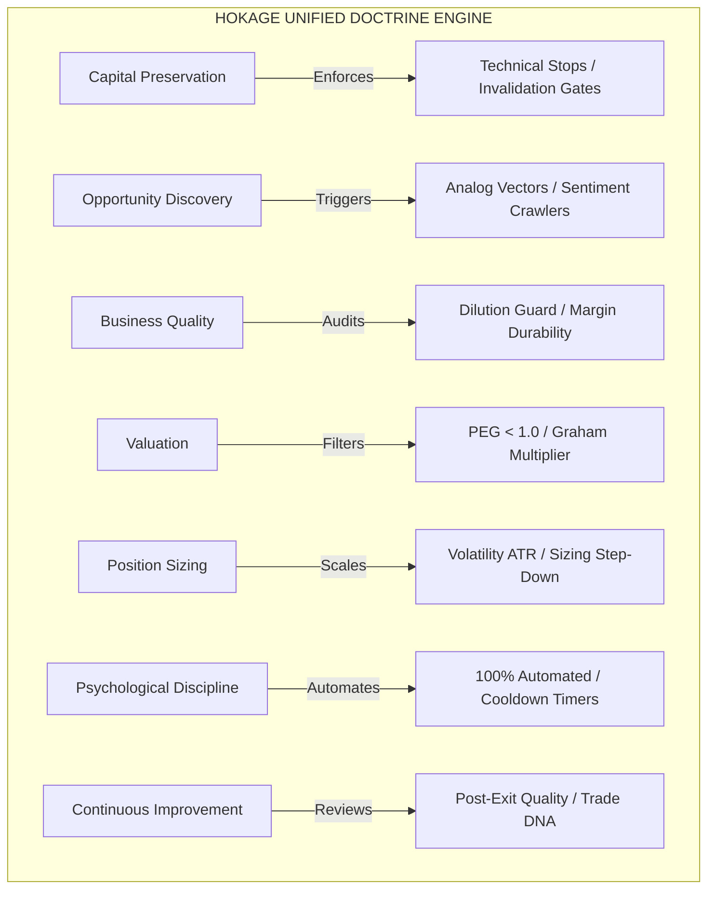

# Hokage Knowledge Consolidation Report
## Phase 4C.5E — Institutional Trading Doctrine & Architecture Audit

This report presents a comprehensive audit of Hokage's six ingested knowledge modules. It maps their overlapping, redundant, or conflicting philosophies into a single unified doctrine architecture and designs the Hokage Alpha Program Phase 1.

---

## 1. Audit of the Six Ingested Modules

Hokage's knowledge registry contains six modules representing different styles, disciplines, and time horizons:
1.  ***Trading in the Zone* (Mark Douglas):** Psychological focus, outcome independence, and mechanical discipline.
2.  ***The Daily Trading Coach* (Brett N. Steenbarger):** Cognitive-behavioral techniques, execution grading, and feedback loops.
3.  ***Market Wizards* (Jack D. Schwager):** Sizing by conviction, dynamic scaling, and capital preservation.
4.  ***One Up On Wall Street* (Peter Lynch):** Growth-based PEG screens, debt limits, and simplicity checks.
5.  ***Common Stocks and Uncommon Profits* (Philip A. Fisher):** Qualitative scuttlebutt, dilution guards, and margin durability.
6.  ***The Intelligent Investor* (Benjamin Graham):** Margin of Safety, Mr. Market manic partner model, and defensive valuation multipliers.

### Duplicate Concepts & Overlapping Doctrines
*   **Pre-Entry Risk Definition:** Douglas's *Pre-defined Risk* (Principle 3) directly duplicates Schwager's *Cut Losses Fast* (Doctrine 2) and Graham's *Margin of Safety* (Doctrine 2). All three insist on locking the invalidation price before entering the market.
*   **Dynamic Size Deceleration:** Douglas's *Losing Streak Capital Decay* (Rule 3) overlaps with Steenbarger's *Autonomic Cooldown* (System 1) and Schwager's *Sizing Step-Down* (Failure Recovery). They all enforce dynamic sizing reductions when performance degrades.
*   **Scuttlebutt & Information Asymmetry:** Lynch's *Research Creates Edge* (Doctrine 7) directly overlaps with Fisher's *Talk To The Ecosystem* (Doctrine 1). Both advocate for direct, non-consensus verification of business demand.

### Contradictory Principles & Resolution
*   **Long-Term Holding vs. Tight Stop-Loss Exits:**
    *   *Conflict:* Fisher ("the time to sell is almost never") and Lynch ("ignore short-term quarterly noise") advocate holding great compounders through severe volatility. Douglas and Schwager insist on tight, absolute technical stops to cut losses instantly.
    *   *Resolution:* HOKAGE implements a **two-speed portfolio structure**. Short-term/medium-term trades are strictly gated by technical stop-loss coordinates. Long-term fundamental investments bypass price stops and are instead subject to a **Fundamental Invalidation Gate** (vetoed if debt-to-equity $> 0.5$, gross margins drop $> 10\%$ relative to industry, or annual share dilution exceeds $3\%$).
*   **Asset-Based Value Cheapness vs. Quality Growth Multiples:**
    *   *Conflict:* Graham's Defensive screen rejects valuations exceeding a $22.5$ PE/PB multiplier product. Fisher warns against this exact behavior, calling it the "PE Fallacy" (passing on great businesses because multiples look temporarily high).
    *   *Resolution:* HOKAGE routes opportunities through **style-specific sizers**. Graham's screens are applied to value/asset-heavy allocations, while Fisher's 15 Points are applied to growth-heavy allocations. Lynch's PEG ratio ($PEG < 1.0$) serves as the canonical arbiter for growth, ensuring the system pays a fair price for compounding.

### Redundant Frameworks
*   **Sizing Multipliers:** Having the *Elder Trust multiplier*, *Losing Streak multiplier*, and *Drawdown step-down* all modify order quantity concurrently creates sizing drag. HOKAGE collapses them into a single multiplicative sizing equation.

### Missing Institutional Concepts
*   **Market Microstructure & Order Routing:** None of the books address algorithmic execution slippage, venue order book depth, dark pools, or latency optimization.
*   **Quantitative Portfolio Math:** Covariance tracking, dynamic risk parity, and mathematical beta hedging are absent from the qualitative texts.
*   **Downside Macro-Hedging:** No rules are defined for asset-class hedging, options volatility fading, or derivative overlays.

---

## 2. Unified Doctrine Architecture

The six books are synthesized into seven canonical doctrines.

### A. Capital Preservation Doctrine
*   **Originating Books:** *Trading in the Zone*, *Market Wizards*, *The Intelligent Investor*.
*   **Supporting Principles:** Survival is the prerequisite for performance (Schwager); Margin of Safety buffer (Graham); Predefined risk (Douglas).
*   **Supporting Frameworks:** Technical stop-loss boundaries, dynamic drawdown caps (2% daily / 10% total), single-symbol exposure limit (max 5%), sector exposure cap (max 25%).
*   **Conflicts Detected:** Long-term business holding vs tight price exits.
*   **Recommended Canonical Version:** Technical stop-loss execution is mandatory for short-term setups. Fundamental setups ignore short-term price stops but are closed instantly if a balance sheet invalidation trigger is hit.

### B. Opportunity Discovery Doctrine
*   **Originating Books:** *One Up On Wall Street*, *Common Stocks and Uncommon Profits*, *Market Wizards*.
*   **Supporting Principles:** Invest in what you understand (Lynch); Ecosystem scuttlebutt (Fisher); Edge identification (Schwager).
*   **Supporting Frameworks:** Six-fold company classification system, 15 Points qualitative checklist, Historical analog vector cosine matching.
*   **Conflicts Detected:** None.
*   **Recommended Canonical Version:** `OpportunityDiscoveryEngine` runs analog vector matching for short-term setups and qualitative ecosystem sentiment crawlers for long-term setups.

### C. Business Quality Doctrine
*   **Originating Books:** *Common Stocks and Uncommon Profits*, *One Up On Wall Street*, *The Intelligent Investor*.
*   **Supporting Principles:** R&D efficiency (Fisher); Simplicity beats complexity (Lynch); Earning stability (Graham).
*   **Supporting Frameworks:** R&D-to-sales ratios, management retention bench audits, Share Dilution Guard (veto if share count increases $\ge 3\%$ annually).
*   **Conflicts Detected:** Fisher growth optionality vs Graham defensive stability.
*   **Recommended Canonical Version:** Fundamental entries must satisfy Lynch's Simplicity Screen (operating margins $\ge 15\%$, debt-to-equity $\le 0.5$) combined with Fisher's Share Dilution Guard ($\le 3\%$).

### D. Valuation Doctrine
*   **Originating Books:** *The Intelligent Investor*, *One Up On Wall Street*, *Common Stocks and Uncommon Profits*.
*   **Supporting Principles:** Price discount to intrinsic value (Graham); Earnings-price tracking (Lynch); PE Fallacy avoidance (Fisher).
*   **Supporting Frameworks:** Graham PE/PB Multiplier limit ($PE \times PB \le 22.5$), 5-Year Earnings Capacity appraisal (multiplier 8-20), PEG ratio ($PEG < 1.0$).
*   **Conflicts Detected:** Graham asset value discount vs Fisher premium growth multiples.
*   **Recommended Canonical Version:** The PEG ratio is the primary arbiter for growth setups ($PEG < 1.0$). For defensive asset setups, the Graham Multiplier ($PE \times PB \le 22.5$) is strictly enforced.

### E. Position Sizing Doctrine
*   **Originating Books:** *The Intelligent Investor*, *Market Wizards*, *Trading in the Zone*, *The Daily Trading Coach*.
*   **Supporting Principles:** Sizing by conviction (Schwager); Volatility-adjusted sizing (Schwager); Dynamic stock-bond scaling (Graham); Losing streak capital decay (Douglas).
*   **Supporting Frameworks:** Volatility (ATR) adjusted share sizing, losing streak sizing decay ($1.0 \to 0.5 \to 0.2$), dynamic stock-bond asset allocation (scaling between 25% and 75% stocks based on valuation extremes).
*   **Conflicts Detected:** Sizing down on drawdown conflicts with scaling up equity allocation in bear market bargain zones.
*   **Recommended Canonical Version:** **Two-Tier Sizing**: Portfolio equity exposure scales based on market valuation extremes (Graham's 25%-75%). Individual trade sizes scale down based on ATR volatility and consecutive losses.

### F. Psychological Discipline Doctrine
*   **Originating Books:** *Trading in the Zone*, *The Daily Trading Coach*, *Market Wizards*.
*   **Supporting Principles:** Carefree execution flow (Douglas); Process over outcome (Steenbarger); Autonomic cooldown (Steenbarger).
*   **Supporting Frameworks:** Slippage/FOMO chase caps (max 1.5% of ATR), 60-minute Autonomic Cooldown lock, 100% human-in-the-loop exclusion during live sessions.
*   **Conflicts Detected:** None.
*   **Recommended Canonical Version:** Order entry and trailing stop execution are completely automated. Discretionary modifications or target widening are blocked by the system.

### G. Continuous Improvement Doctrine
*   **Originating Books:** *The Daily Trading Coach*, *Common Stocks and Uncommon Profits*.
*   **Supporting Principles:** Self-Coaching split (Steenbarger); Exception analysis (Steenbarger); Continuous research (Fisher).
*   **Supporting Frameworks:** Post-Exit quality grading (0-100 scores for entry, sizing, stop, and exit quality), Trade DNA fingerprinting (WIN/LOSS/BREAKEVEN profiles), EOD learning updates.
*   **Conflicts Detected:** None.
*   **Recommended Canonical Version:** Layer 2 review processes run asynchronously post-exit, updating `position_reviews.jsonl` and `trade_dna.jsonl` at the end of each session.

---

## 3. Knowledge Coverage Assessment

Hokage's current institutional knowledge coverage is rated below on a scale from 0 to 10:

| Dimension | Rating | Description / Analysis |
| :--- | :---: | :--- |
| **Trading Psychology** | `9.5/10` | Douglas & Steenbarger models are fully coded: automated IC gates, cooldown timers, psychological vetoes, personality modes. |
| **Risk Management** | `9.0/10` | Uncompromising Stop Loss enforcements, drawdown caps, sector/symbol exposure limits, no-averaging-down checks. |
| **Opportunity Discovery** | `8.0/10` | Analog Cosine matching, sentiment index trackers, news sentiment, Sector Rotation. |
| **Business Analysis** | `7.5/10` | Lynch classifications, R&D efficacy metrics, share dilution safeguards, debt-to-equity checks. |
| **Valuation** | `8.5/10` | PEG screens, net-cash share adjustments, Graham 22.5 multiplier checks, 5-year average earnings capacity. |
| **Position Sizing** | `9.0/10` | ATR-adjusted sizing, dynamic stock-bond asset allocation scaling, Elder Trust multipliers, losing streak decay. |
| **Portfolio Construction** | `7.0/10` | Simple sector caps and symbol caps. Lacks advanced covariance matrix optimization, risk parity, or portfolio correlation math. |
| **Market Regime Analysis** | `8.0/10` | ADX trends, VIX stress metrics, Sector Rotation, Historical analog matching. |
| **Continuous Learning** | `8.5/10` | Asynchronous Layer 2 position reviews, win/loss trade DNA profiling, EOD learning updates. |
| **Institutional Discipline** | `9.5/10` | Full 7-gate IC chain, immutable decision journals, separate outcomes database, human-in-the-loop vetoes. |

---

## 4. Top 10 Knowledge Gaps

The following core institutional knowledge gaps remain:
1.  **Market Microstructure & Algorithmic Execution:** Lacks spread matching, venue order book depth audits, and smart order routing.
2.  **Portfolio Covariance / Correlation Math:** Lacks dynamic covariance tracking, risk parity optimization, and mathematical variance minimization.
3.  **Dynamic Hedging Frameworks:** Lacks systemic options/futures hedging, delta-neutral strategies, or downside protection via derivatives.
4.  **Interest Rate & Macro Sensitivity Models:** Lacks modeling of central bank cycles, yield curves, bond-yield spreads, or discount rate shifts.
5.  **Multi-Asset Class Arbitrage:** Lacks cash-vs-futures spreads or index tracking discrepancies.
6.  **Machine Learning / Sentiment Embeddings:** Current sentiment relies on basic RSS feeds; lacks deep LLM-based news parsing or vector embeddings.
7.  **Tax-Aware Optimization Sizing:** Tracks tax, but doesn't optimize position sizing or holding periods to minimize tax drag.
8.  **Alternative Data Streams Ingestion:** Lacks scuttlebutt data sources like credit card transaction logs, satellite imagery, or app download metrics.
9.  **Intraday Volume/Liquidity Shock Detection:** Lacks modeling of intraday liquidity holes or volume profile anomalies.
10. **Global Macro / Cross-Border Capital Flows:** Lacks tracking of FX flows, dollar index shifts, or global liquidity cycles.

---

## 5. Recommendation

**Hokage should freeze knowledge acquisition and begin the Hokage Alpha Program.**

*Rationale:* The Knowledge Ingestion Layer is now highly comprehensive, covering value, growth, psychology, risk, coaching, and momentum styles. Continuing to ingest more books at this stage will result in diminishing returns, conceptual bloat, and structural redundancy. Hokage now has a complete set of read-only frameworks. To validate these frameworks, the system must undergo a live-data testing sandbox. The Hokage Alpha Program will test these rules against real market conditions, building empirical records of compliance, slippage, and performance.

---

## 6. Hokage Alpha Program Phase 1 Design

The Hokage Alpha Program is designed to test compliance, execution slippage, and strategy expectancy under live market conditions using simulated capital.

### Program Specifications
*   **Duration:** 3 Calendar Months (approx. 90 calendar days / 60 active trading sessions).
*   **Paper-Trade Requirements:**
    *   Exclusively run in `PAPER` mode on registered execution venues (no live writes).
    *   Minimum of 100 closed trades to build a statistically valid dataset.
    *   Maximum concurrent positions capped at 10 symbols.
    *   Execution must be 100% automated (discretionary modifications are physically blocked).

### Metrics and Review Cadence

| Metric Category | Target threshold | Tracking Engine / Subsystem |
| :--- | :---: | :--- |
| **Compliance Score** | $\ge 95\%$ | `PerformanceAnalytics` (zero manual adjustments / veto bypasses) |
| **Profit Factor** | $\ge 1.30$ | `PerformanceAnalytics` (gross profits / gross losses) |
| **Sharpe Ratio** | $\ge 1.20$ | `PerformanceAnalytics` (risk-free rate = 0%) |
| **Execution Quality Grade** | $\ge 80$ | `PositionReviewEngine` (average Entry/Sizing/Stop/Exit scores) |
| **Max Drawdown Limit** | $< 8.0\%$ | `CapitalPreservationEngine` (peak-to-trough equity decay) |
| **Slippage Variance** | $< 2.0\%$ of ATR | `PerformanceAnalytics` (trigger vs fill price) |

*   **Review Cadence:**
    *   *Daily:* Automated EOD debriefing generation checking compliance and daily PnL.
    *   *Weekly:* Run rolling performance analytics, slippage audits, and update Elder Trust scores.
    *   *Monthly:* Full analog matching review, sector rotation updates, and cash-bond allocation rebalancing.

### Promotion Criteria
1.  Completion of the 90-day phase with all success metrics met.
2.  No failure metrics triggered (e.g., drawdown remains below 8% and compliance score remains above 95%).
3.  100% of decisions recorded in the immutable `decision_journal.jsonl`.
4.  Verdict: PASS from final repository hygiene check.
