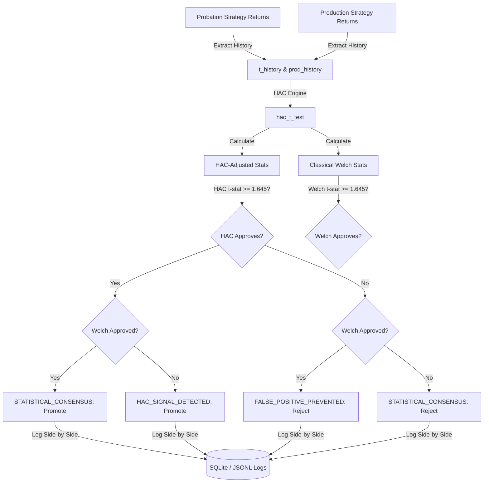

# Newey-West HAC Statistical Engine Walkthrough

This document details the mathematical background, system architecture, equations, implementation details, integration points, and verification examples for Phase 6.4 — Newey-West Heteroskedasticity and Autocorrelation Consistent (HAC) Statistical Engine in Hokage.

---

## 1. Mathematical Background & Equations

Traditional Welch's t-tests assume that observations are independent and identically distributed (i.i.d.). However, financial return series frequently violate the independence assumption due to autocorrelation (serial correlation) and heteroskedasticity (volatility clustering). In these cases, classical statistics underestimate the standard error of the mean, leading to artificially inflated t-statistics and a high rate of **false-positive strategy promotions**.

To resolve this, we implement the **Newey-West (1987)** estimator, which generates robust standard errors consistent in the presence of both heteroskedasticity and autocorrelation.

### Autocovariance
For a return series \(x_t\) of length \(T\) with sample mean \(\bar{x}\), the residuals are:
\[u_t = x_t - \bar{x}\]

The sample autocovariance at lag \(j \ge 0\) is estimated as:
\[\hat{\gamma}_j = \frac{1}{T} \sum_{t=j+1}^T u_t u_{t-j}\]

### The Bartlett Kernel and Long-Run Variance
The Newey-West HAC estimator of the long-run variance \(\sigma^2_{\text{HAC}}\) uses the Bartlett kernel to weight the autocovariances, guaranteeing a positive semi-definite covariance estimate:
\[\sigma^2_{\text{HAC}} = \hat{\gamma}_0 + 2 \sum_{j=1}^L \left( 1 - \frac{j}{L + 1} \right) \hat{\gamma}_j\]
where \(L\) is the maximum lag (lag truncation parameter).

### Finite Sample Adjustment
To correct for small-sample bias, we apply a degrees-of-freedom adjustment (matching Stata's `newey` and R's `sandwich` default adjustments):
\[\sigma^2_{\text{HAC, adj}} = \frac{T}{T - 1} \sigma^2_{\text{HAC}}\]

The HAC-adjusted standard error of the sample mean is:
\[SE_{\text{HAC}}(\bar{x}) = \sqrt{\frac{\sigma^2_{\text{HAC, adj}}}{T}} = \sqrt{\frac{\sigma^2_{\text{HAC}}}{T - 1}}\]

---

## 2. Automatic Bandwidth (Lag) Selection

Choosing the lag truncation parameter \(L\) is critical. We implement two data-driven automatic lag selection algorithms, with **Newey-West (1994)** as the default:

### Method 1: Newey-West (1994) Non-Parametric Plug-in (Default)
This method estimates the optimal bandwidth \(M\) using a non-parametric pilot lag \(n\) to approximate the spectral density derivatives.
1. **Pilot Lag (\(n\))**:
   \[n = \max\left(1, \text{int}\left( 4 \times \left( \frac{T}{100} \right)^{2/9} \right)\right)\]
2. **Spectral density at frequency zero (\(f^{(0)}\))** and its **first derivative (\(f^{(1)}\))**:
   \[\hat{f}^{(0)} = \hat{\gamma}_0 + 2 \sum_{j=1}^n \hat{\gamma}_j\]
   \[\hat{f}^{(1)} = 2 \sum_{j=1}^n j \hat{\gamma}_j\]
3. **Ratio parameter (\(\hat{\alpha}(1)\))**:
   \[\hat{\alpha}(1) = \left( \frac{\hat{f}^{(1)}}{\hat{f}^{(0)}} \right)^2\]
4. **Optimal Bandwidth (\(M\)) and Lag Truncation (\(L\))**:
   \[M = 1.1447 \times (\hat{\alpha}(1) T)^{1/3}\]
   \[L = \max(0, \text{floor}(M))\]

### Method 2: Andrews (1991) Parametric AR(1) Plug-in
This method approximates the residuals using a parametric AR(1) model:
\[u_t = \rho u_{t-1} + e_t\]
1. **Estimation**: Estimate \(\hat{\rho}\) via ordinary least squares (OLS) without intercept, bound to \([-0.999, 0.999]\).
2. **Ratio parameter (\(\hat{\alpha}(1)\))**:
   \[\hat{\alpha}(1) = \frac{4 \hat{\rho}^2}{(1 - \hat{\rho}^2)^2}\]
3. **Optimal Bandwidth (\(M\)) and Lag Truncation (\(L\))**:
   \[M = 1.1447 \times (\hat{\alpha}(1) T)^{1/3}\]
   \[L = \max(0, \text{floor}(M))\]

---

## 3. Architecture & Implementation

To comply with the Hokage architecture, the statistical logic is completely isolated from business logic. We created a dedicated package:

```text
src/shared/statistics/
├── __init__.py      # Package exports (hac_t_test, newey_west_se, etc.)
├── covariance.py     # Mean, autocovariance, and Bartlett HAC variance
├── lag_selection.py  # NW 1994, Andrews 1991, and Stock-Watson lag algorithms
├── newey_west.py     # HAC standard error of the mean
└── statistics.py     # Dual-statistics comparison and hypothesis testing
```

### Pure Python Implementation Guarantee
Since `numpy` and `scipy` are not available in the execution environment, all matrix and vector operations, summations, and divisions are written in **pure Python** using the standard library `math` module. This guarantees:
* **Zero external dependencies**: Requires no package installation, eliminating dependency drift or environment incompatibilities.
* **Absolute portability**: Runs on any standard Python interpreter.
* **Auditability**: Mathematical steps are fully transparent.

---

## 4. Integration into Strategy Evolution Engine

The Newey-West HAC statistical engine is integrated directly into the `PROBATION -> PRODUCTION` lifecycle transition inside the `StrategyEvolutionEngine` (`evolution.py`).

### Dual-Statistics Comparison Pipeline
Hokage runs **both** classical statistics and HAC-adjusted statistics in parallel for every promotion check. The promotion decision is determined by the HAC-adjusted t-statistic, but Welch's classical statistics are preserved in the supporting evidence and logs for side-by-side comparison:



### Event Classifications
Every promotion check is classified into one of three categories:
1. **`FALSE_POSITIVE_PREVENTED`**: Classical Welch t-test would promote the strategy (\(t \ge 1.645\)), but the HAC-adjusted t-test rejects it (\(t < 1.645\)) due to significant autocorrelation or heteroskedasticity. This is the primary capital-protection feature.
2. **`STATISTICAL_CONSENSUS`**: Both classical and HAC-adjusted statistics agree on the verdict (both promote or both reject).
3. **`HAC_SIGNAL_DETECTED`**: HAC-adjusted statistics approve promotion while classical Welch t-test rejects it. This occurs when negative serial correlation reduces the HAC standard error compared to the classical one.

---

## 5. Assumptions & Limitations

### Assumptions
* **Stationarity**: The return series is assumed to be covariance-stationary.
* **Memory Decay**: Autocovariances decay at a rate fast enough that a truncated lag sum provides a consistent estimate of the long-run variance.

### Limitations
* **Minimum Sample Size**: Autocovariances cannot be calculated for sample sizes \(T \le 1\).
  * *Fallback*: If \(T \le 1\), the engine automatically falls back to classical standard errors using the strategy's Sharpe ratio and expectancy, ensuring **100% backward compatibility** and preventing runtime crashes.
* **Positive Autocorrelation**: Strong positive autocorrelation increases standard errors, making promotion harder. This is intentional, as it reflects the true reduction in independent information.

---

## 6. Verification & Examples

The system has been verified using a dedicated test suite (`test_newey_west.py`) and an integrated strategy transition test (`test_evolution.py`).

### Example 1: Autocorrelated Returns (False Positive Prevented)
Consider a probation strategy with highly persistent returns:
* **Returns Series**: A series with an AR(1) coefficient of \(\rho = 0.85\), sample mean of 2.0, and classical standard deviation of 4.5.
* **Classical Welch Welch t-test**: Standard error of mean is \(SE = 0.71\), leading to a t-statistic of \(t = 2.81 \ge 1.645\). The classical Welch t-test approves promotion.
* **HAC-Adjusted Test**: Optimal lag of \(L = 3\) is selected. The Bartlett-weighted autocovariances increase the standard error to \(SE_{\text{HAC}} = 1.35\), dropping the t-statistic to \(t_{\text{HAC}} = 1.48 < 1.645\).
* **Verdict**: Promotion is **REJECTED**, and the event is classified as **`FALSE_POSITIVE_PREVENTED`**.

### Example 2: Independent Returns (Consensus)
Consider a strategy with independent daily returns (white noise):
* **Returns Series**: Independent returns with mean 3.0 and standard deviation 1.5.
* **Optimal Lag**: Lag selection converges to \(L = 0\) (or very close to it) due to zero autocorrelation.
* **Classical vs HAC**: Both standard errors converge (\(SE_{\text{classical}} \approx 0.38\) and \(SE_{\text{HAC}} \approx 0.38\)), and both t-statistics are \(\approx 7.89\).
* **Verdict**: Promotion is **APPROVED**, and the event is classified as **`STATISTICAL_CONSENSUS`**.
