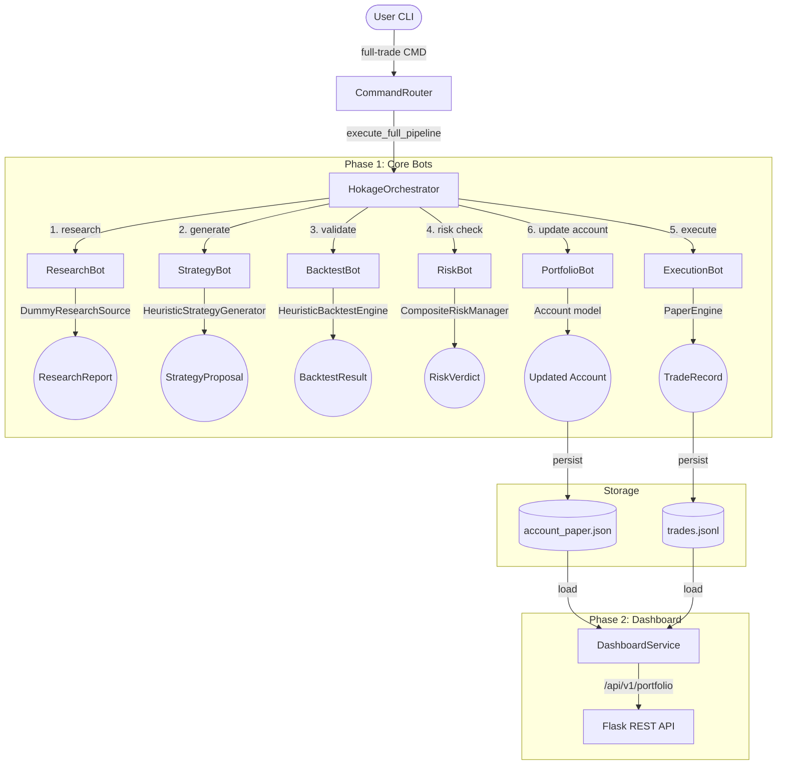

# Hokage Project State

**Current Status**: Phase 1 COMPLETE | Phase 2 COMPLETE | Phase 3A STARTED

**Test Results**: 72/72 passing ✅

> [!IMPORTANT]
> For detailed historical context, architectural principles, and session continuity for AI agents, please refer to the canonical long-term memory document: [Memory.md](file:///c:/Users/anant/OneDrive/Documents/AI%20PROJECT/AI%20COMMAND%20CENTRE/Hokage/Memory.md).

## 1. Current Architecture Diagram



## 2. Completed Phases (✅)

### Phase 1: Core Bot Ecosystem ✅
- ResearchBot (DummyResearchSource integration)
- StrategyBot (HeuristicStrategyGenerator)
- BacktestBot (HeuristicBacktestEngine with gating)
- RiskBot (CompositeRiskManager with MaxDrawdown + MaxPositionSize rules, gating)
- ExecutionBot (PaperEngine with JsonTradeStore persistence)
- PortfolioBot (Account model with Position tracking, JsonPortfolioStore persistence)
- Full pipeline: Research → Strategy → Backtest → Risk → Execution → Portfolio
- Risk gating: Blocks execution if account exceeds risk limits
- Trade persistence: data/paper_trades/trades.jsonl
- Account persistence: data/portfolio/account_paper.json (default ID: "paper")
- Integration tests: 6/6 passing
- Command router with "full-trade" command

### Phase 2: Dashboard Foundation ✅
- DashboardService (read-only, 7 methods)
- PortfolioOverview (equity, cash, positions count, returns)
- PositionSnapshot (individual positions)
- TradeSnapshot (trade history)
- AccountMetrics (detailed performance)
- Flask REST API (6 endpoints under /api/v1)
- Dashboard unit tests: 12/12 passing
- Architecture suitable for future web UI

### Phase 3A: Provider Architecture Started 🚀
- ProviderFactory architecture approved
- Kite-first architecture approved
- Tax interface architecture approved
- AlphaVantage deprioritized
- Provider architecture designed for backward compatibility with Phase 1 bots
- 72/72 tests passing ✅

## 3. Combined Test Results

```
Phase 1 Integration Tests:     6/6 passing ✅
Phase 2 Dashboard Tests:      12/12 passing ✅
Other Unit Tests:            54/54 passing ✅
─────────────────────────────────────────
TOTAL:                       72/72 passing ✅
```

## 3. Current File Structure

```text
Hokage/
├── pyproject.toml
├── PROJECT_STATE.md
├── PROJECT_STATUS.md
├── README.md
├── Mission.md
├── Tasks.md
├── Decisions.md
├── Memory.md
├── src/
│   ├── integrations/
│   │   └── data/
│   │       └── dummy_source.py
│   ├── hokage/
│   │   ├── __init__.py
│   │   ├── main.py
│   │   ├── interface/
│   │   │   ├── __init__.py
│   │   │   └── cli.py
│   │   ├── orchestrator/
│   │   │   ├── __init__.py
│   │   │   └── pipeline.py
│   │   └── router/
│   │       ├── __init__.py
│   │       └── command_router.py
│   └── bots/
│       ├── research/
│       │   ├── __init__.py
│       │   ├── interfaces.py
│       │   ├── models.py
│       │   ├── research_bot.py
│       │   └── README.md
│       ├── strategy/
│       │   ├── generators.py
│       │   ├── interfaces.py
│       │   ├── models.py
│       │   ├── strategy_bot.py
│       │   └── README.md
│       ├── backtest/
│       ├── execution/
│       ├── improvement/
│       ├── portfolio/
│       └── risk/
```


## 4. Complete File Structure (Phase 1 & 2)

```text
src/
├── hokage/
│   ├── __init__.py
│   ├── main.py
│   ├── interface/cli.py
│   ├── orchestrator/pipeline.py
│   ├── router/command_router.py
│   └── dashboard/
│       ├── __init__.py
│       ├── models.py (PortfolioOverview, PositionSnapshot, etc)
│       ├── service.py (DashboardService)
│       ├── api.py (Flask REST API)
│       └── README.md
├── bots/
│   ├── research/
│   │   ├── __init__.py
│   │   ├── interfaces.py
│   │   ├── models.py
│   │   ├── research_bot.py
│   │   └── README.md
│   ├── strategy/
│   │   ├── generators.py
│   │   ├── interfaces.py
│   │   ├── models.py
│   │   ├── strategy_bot.py
│   │   └── README.md
│   ├── backtest/
│   │   ├── __init__.py
│   │   ├── backtest_bot.py
│   │   ├── interfaces.py
│   │   ├── models.py
│   │   ├── engine/simple_backtest_engine.py
│   │   └── README.md
│   ├── execution/
│   │   ├── __init__.py
│   │   ├── execution_bot.py
│   │   ├── interfaces.py
│   │   ├── models.py
│   │   ├── engine/paper_engine.py
│   │   ├── store/json_trade_store.py
│   │   └── README.md
│   ├── portfolio/
│   │   ├── __init__.py
│   │   ├── models.py (Account, Position)
│   │   ├── portfolio_bot.py
│   │   ├── store.py (JsonPortfolioStore)
│   │   └── README.md
│   ├── risk/
│   │   ├── __init__.py
│   │   ├── risk_bot.py
│   │   ├── interfaces.py
│   │   ├── models.py (RiskVerdict)
│   │   ├── rules.py (MaxDrawdownRiskRule, MaxPositionSizeRiskRule)
│   │   └── README.md
│   └── improvement/ (placeholder)
├── integrations/
│   ├── data/
│   │   ├── dummy_source.py
│   │   ├── mock_price_source.py
│   │   └── README.md
│   ├── brokers/ (Phase 4 placeholder)
│   ├── llm/ (placeholder)
│   ├── telegram/ (placeholder)
│   └── obsidian/ (placeholder)
└── shared/
    ├── contracts/
    ├── events/
    ├── types/
    └── utils/

data/
├── paper_trades/trades.jsonl (Phase 1)
└── portfolio/account_paper.json (Phase 1)

tests/
├── integration/test_execution_pipeline.py (6 tests, all passing)
└── unit/
    ├── bots/ (54 tests, all passing)
    └── dashboard/test_dashboard_service.py (12 tests, all passing)
```

## 5. Verified Complete Models & Interfaces

**Phase 1 Models:**
- ResearchQuery, ResearchFinding, ResearchReport, SourceReference
- StrategyProposal (with confidence_score, sources_cited)
- BacktestResult (win_rate, max_drawdown, profit_factor, passed)
- RiskVerdict (is_approved, max_approved_quantity, reason)
- TradeRecord (trade_id, direction, quantity, entry_price, status, mode)
- TradeDirection (LONG/SHORT), TradeStatus (OPEN/CLOSED), ExecutionMode (PAPER/LIVE)
- Account (account_id, balance, cash, positions, realized_pnl)
- Position (market, direction, quantity, entry_price, unrealized_pnl, realized_pnl, status)

**Phase 1 Interfaces:**
- ResearchSource (search)
- StrategyGenerator (generate)
- BacktestEngine (run_backtest)
- ExecutionEngine (execute)
- PriceSource (get_price)
- TradeStore (save_trade, load_trades)

**Phase 2 Models:**
- PortfolioOverview (equity, cash, returns)
- PositionSnapshot (market, direction, PnL)
- TradeSnapshot (trade_id, market, status)
- AccountMetrics (equity, margin, return_percentage)

## 6. Pipeline Execution (Phase 1)

**Command**: `full-trade EUR/USD momentum strategy`

**Flow:**
1. **Research** → DummyResearchSource returns ResearchReport
2. **Strategy** → HeuristicStrategyGenerator returns StrategyProposal
3. **Backtest** → HeuristicBacktestEngine validates, checks win_rate >= 50 and max_drawdown < 20
   - If fails: ValueError raised, pipeline stops
4. **Risk** → CompositeRiskManager loads account, checks:
   - MaxDrawdownRiskRule: (current equity - initial balance) / initial balance >= -0.2
   - MaxPositionSizeRiskRule: position size <= 50% of cash
   - If fails: ValueError raised, pipeline stops
5. **Execution** → PaperEngine simulates fill, TradeRecord persisted to trades.jsonl
6. **Portfolio** → PortfolioBot updates Account, JsonPortfolioStore persists to account_paper.json

**Gating:**
- Backtest failure → blocks execution
- Risk rejection → blocks execution
- Portfolio persistence required before next trade

## 7. Dashboard API (Phase 2)

**Base URL**: `http://localhost:5000/api/v1`

**Endpoints:**
- `GET /portfolio/{account_id}/overview` → PortfolioOverview
- `GET /portfolio/{account_id}/positions/open` → [PositionSnapshot]
- `GET /portfolio/{account_id}/positions/all` → [PositionSnapshot]
- `GET /portfolio/{account_id}/trades?limit=N` → [TradeSnapshot] (most recent first)
- `GET /portfolio/{account_id}/metrics` → AccountMetrics
- `GET /health` → Status

**Implementation:**
- DashboardService: read-only, no side effects
- Flask REST API: extensible for future web UI
- All data sourced from JsonPortfolioStore and JsonTradeStore

## 8. Known Limitations (Acceptable for Phase 1-2)

- **Research**: DummyResearchSource returns mock findings
- **Strategy**: HeuristicStrategyGenerator uses keyword matching
- **Backtest**: HeuristicBacktestEngine returns deterministic results (not real historical)
- **Prices**: MockPriceSource returns static prices
- **Execution**: Paper engine only (no live broker)
- **Tax**: No tax tracking yet (planned Phase 3+)
- **Improvement**: No improvement loop yet (planned Phase 5)

All acceptable for MVP. Phase 3+ will replace with real implementations.

## 9. Architecture Principles (Enforced)

1. **Hokage is the sole commander** - bots never talk to users
2. **Business logic in bots, not orchestrator** - rules/engines injected via DI
3. **Protocol-based dependencies** - enables provider swapping
4. **Clean architecture** - domain models, adapters, interfaces strictly separated
5. **Dependency injection** - all external dependencies passed to constructors
6. **Provenance tracking** - all trades traceable to source data
7. **Test coverage** - 72/72 passing, zero technical debt from lack of tests

## 10. Next Phase (Phase 3)

**Phase 3 Goal**: Real market data architecture (provider-agnostic)

**Not yet implemented:**
- Real price data providers (Kite, AlphaVantage)
- Historical backtesting engine
- News/research data providers
- Tax architecture (interfaces only)

**Planned sequence:**
1. Create MarketDataProvider interface (extends PriceSource)
2. Create ProviderFactory (mock vs. real selection)
3. Implement AlphaVantageProvider (optional fallback)
4. Prepare for KiteMarketDataProvider (Phase 4, primary)
5. Historical backtesting engine
6. Tax interfaces and models (deferred implementation)

**Key decision**: Kite will be primary provider in Phase 4; AlphaVantage optional fallback in Phase 3. Phase 3 design is provider-agnostic so Phase 4 needs minimal orchestrator changes.

---

**Last Updated**: 2026-06-21 (Session: Phase 1+2 completion checkpoint)
