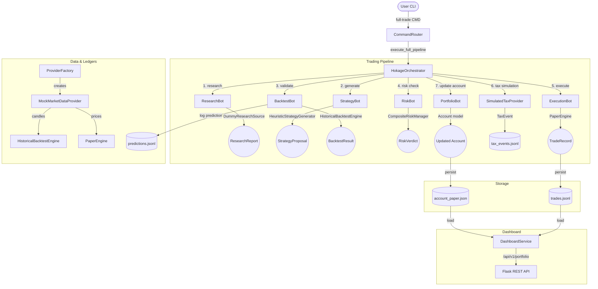

# Hokage Project State

Comprehensive repository state tracking.

> [!IMPORTANT]
> **Core Doctrine**: Hokage must evolve into a Global Opportunity Discovery Engine.
> **The Prime Objective**: Find the highest risk-adjusted opportunity available anywhere within the approved investment universe.

## 1. Test Suite Results (527/527 Passing)

```
Integration Tests:             30/30  passing ✅
Dashboard Service/API Tests:   14/14  passing ✅
Provider/Tax/Ledger/Venue:     42/42  passing ✅
Portable Brain Unit Tests:      7/7   passing ✅
Core Component Unit Tests:     56/56  passing ✅
Autonomous Bot Tests:          20/20  passing ✅
Capital Preservation Tests:     5/5   passing ✅
Identity/Conviction Tests:     19/19  passing ✅
Decision Journal Tests:        24/24  passing ✅
Knowledge Engine Tests:        10/10  passing ✅
Performance Analytics Tests:   34/34  passing ✅
Portfolio Intelligence Tests:   5/5   passing ✅
Position Review Tests:         29/29  passing ✅
Predictive Tests:               4/4   passing ✅
Trade DNA Tests:               28/28  passing ✅
Trust Engine Tests:             1/1   passing ✅
Command Interface Tests:       16/16  passing ✅
Natural Language Router Tests: 13/13  passing ✅
Improvement Bot Tests:          1/1   passing ✅
SQLite Persistence/Migration:    8/8   passing ✅
Broker Reconciliation:         15/15  passing ✅
Credential Security/Secrets:    5/5   passing ✅
Watchdog & Heartbeats:          9/9   passing ✅
Newey-West HAC Statistics:     11/11  passing ✅
Shadow Trading Framework:       8/8   passing ✅  [Phase 6.5 & Shadow Mode Complete]
Statistical Diagnostics (6.6A): 11/11 passing ✅  [Phase 6.6A NEW]
Execution Friction (6.6B):     8/8   passing ✅  [Phase 6.6B NEW]
─────────────────────────────────────────────────
TOTAL:                        527/527 passing ✅
```

## 2. Mermaid Architecture Diagram



## 3. Milestones and Progression

### Phase 1: Core Bot Ecosystem (COMPLETE)
- **Description**: Integrated core bots (`ResearchBot`, `StrategyBot`, `BacktestBot`, `RiskBot`, `ExecutionBot`, `PortfolioBot`), trade/portfolio JSON storage (`trades.jsonl`, `account_paper.json`), and CLI router REPL.
- **Enforced Principles**:
  - Centralized Commander: bots never communicate directly with users.
  - Dependency Injection: generators, engines, and stores are passed via constructors to bots.
  - Traceability: every trade has full audit links back to inputs and market data providers.

### Phase 2: Dashboard Foundation (COMPLETE)
- **Description**: Read-only `DashboardService` and Flask REST API endpoints under `/api/v1` for portfolio queries.

### Phase 3A: Provider & Tax Architecture (COMPLETE)
- **Description**: `ProviderFactory` runtime configurations, `MockMarketDataProvider` with daily candle generation, `HistoricalBacktestEngine`, `SimulatedTaxProvider` calculating transaction fees, and distinct log files (`predictions.jsonl`, `tax_events.jsonl`).

### Phase 4A: Universal Execution Infrastructure (COMPLETE)
- **Description**: Designed and implemented the unified `BaseExecutionVenue` interface and `ExecutionVenueRegistry` to support future multi-venue trading (Zerodha, Binance, OANDA, etc.) without strategy changes.

### Phase 4A.5: Portable Brain Foundation & Isolation (COMPLETE)
- **Description**: Implemented canonical user-agnostic storage structure under `hokage_brain/` with automatic directory bootstrapping, `PathResolver` to resolve directories dynamically, metadata configurations (`brain.json` and `venues.json`), and SHA-256 state hashing. Fully decoupled the dashboard REST API and core CLI pipeline from hardcoded root paths.

### Phase 4B: PaperVenue & UEI Integration (COMPLETE)
- **Description**: Implemented the first standardized execution venue `PaperVenue` conforming to `BaseExecutionVenue`. Designed and integrated `ExecutionIntent` and expanded `VenueCategory`. Performed a comprehensive hardening audit (Phase 4B.1), removing mutable quantity engine injection, routing parameters explicitly without kwargs, and establishing multi-venue disk storage isolation.

### Phase 4C.1: Zerodha Connectivity Foundation (Read-Only Mode) (COMPLETE)
- **Description**: Integrated official `kiteconnect` client library. Implemented `SecretManager` for platform-specific credentials isolation, `KiteConnectionManager` for session authentication, `KiteAccountService` for balance/positions/holdings, and `KiteMarketDataProvider`. Wired natural language CLI query routing and verified via 136/136 tests.

### Phase 4C.2: Zerodha Interactive Shell Integration (COMPLETE)
- **Description**: Integrated natural language query routing in CLI CommandRouter (holdings, funds, positions, profile, market, watchlist). Introduced `ExecutionMode` enum and `ExecutionContext` model for dynamic environment toggling. Restricted Zerodha live writes to `READ_ONLY` mode and paper trading to `PAPER` mode via active context checks. Verified via 144/144 tests passing. Status: Execution Capability: Supported Architecturally: YES, Enabled: NO, Current Mode: READ_ONLY.

### Phase 4C.3: Autonomous Trading Bot (COMPLETE)
- **Description**: Designed and implemented `AutonomousTradingBot` exposing interval scan scheduler (NSE hours tracker), active stop-loss (TSL)/take-profit (TP) exits, ranking, risk sizing, and order placement via registered venues. Exposed lifecycle controllers and briefings commands in pipeline and command router. Verified via 149/149 tests passing.

### Phase 4C.4: Two-Speed Brain & Market Intelligence Engine (COMPLETE)
- **Description**: Implemented Two-Speed Brain Architecture separating Layer 1 (Fast Trading Brain) from Layer 2 (Deep Intelligence Brain) via an isolated Intelligence Cache (`hokage_brain/intelligence/`). Implemented MarketScanner index quotes tracker, News RSS feed sentiment analyzer, Geopolitical impact assessment, SectorRotationEngine, HistoricalAnalogEngine vector matching, morning/daily briefings, and close of day learning loop updating `market_events.jsonl` dynamically. Optimized Layer 1 scan speeds via batch price loading and concurrent `ThreadPoolExecutor` asset analysis. Verified via 158/158 tests passing. Status: Execution Capability: Supported Architecturally: YES, Enabled: NO, Current Mode: READ_ONLY/PAPER.

### Phase 4C.5: Capital Allocation & Capital Preservation (COMPLETE)
- **Description**: Replaced watchlist scanning with dynamic opportunity discovery. Implemented `ConvictionScoreEngine` (0-100 score on 9 parameters), `NoTradeDecisionEngine` (deployment checks), `ConfidenceCalibrationEngine` (recalibrator), `PortfolioAwareness` (drawdowns, beta, exposures), `PortfolioHealthScore` (0-100), `PositionAllocationEngine` (sizers, exposure impact), `CapitalPreservationEngine` (drawdown caps, losing streak scaling, and Recovery Mode rules), `PerformanceAnalyticsEngine`, `ElderTrustEngine` (trust score 0-100, grades A-F), `PortfolioManagerPersonalityLayer` (Aggressive, Balanced, Defensive, Recovery, Adaptive), and `DecisionJournalSystem` (accepted/rejected logs persisted to `hokage_brain/journal/decision_journal.jsonl`). Integrated sizer tables, preservation modes, and trust ratings into pre-market briefings. Enforced Fast Trading Brain execution constraints under 5-second latency targets. Verified via 175/175 tests passing. Status: Execution Capability: Supported Architecturally: YES, Enabled: NO, Current Mode: READ_ONLY/PAPER.

### Phase 4C.5D: Performance Analytics & Decision Intelligence (COMPLETE)
- **Description**: Expanded Hokage with full institutional-grade analytics and decision auditability.
  - **`performance_analytics.py`**: Added Sharpe ratio (risk-free=0%), profit factor, expectancy, drawdown analytics, holding period stats, rolling metrics, and multi-dimensional queries (regime/sector/conviction grade). All records cross-referenced by `decision_id`.
  - **`decision_journal.py`**: Added `reasoning_chain` (7-gate IC audit trail per decision), `update_decision_outcome` writing to immutable `decision_outcomes.jsonl` (linked by `decision_id`), and `get_summary_stats` (acceptance rate, most common veto, avg conviction by acceptance status).
  - **`position_review.py`** (NEW): Post-exit quality engine computing entry/exit/sizing/stop quality grades, actual R:R achieved, and auto-generating structured lessons. Runs asynchronously via `ThreadPoolExecutor` (Layer 2) after exit, never blocking Layer 1.
  - **`trade_dna.py`** (NEW): Fingerprinting framework recording WIN/LOSS/BREAKEVEN DNA per closed trade. Queryable by regime, sector, conviction grade, holding period, and result. Stored in `hokage_brain/intelligence/trade_dna.jsonl`.
  - **`models.py`**: Added `PositionReview` dataclass as canonical domain model.
  - **`autonomous_bot.py`**: Wired full 7-gate reasoning chain construction across IC gates (CapitalPreservation → PortfolioHealth → ConvictionScore → ConfidenceCalibration → NoTradeDecision → PositionAllocation → RiskBot → Execute). All `record_decision` calls now include the complete chain. Layer 2 async tasks run Position Review + Trade DNA in `ThreadPoolExecutor` post-exit.
  - **`briefings.py`**: Added Section 5 Performance Analytics to daily briefing (rolling win rate, Sharpe, profit factor, expectancy, max drawdown, acceptance rate, most common veto).
  - Verified via 307/307 tests passing. Hygiene PASS. Status: All 6 Phase 4C.5D architectural decisions implemented and verified.

### Phase 4C.5E: Knowledge Ingestion Layer (COMPLETE)
- **Description**: Standardized permanent institutional trading knowledge structures into the portable brain.
  - **`TRADING_IN_THE_ZONE_PLAYBOOK.md`**, **`THE_DAILY_TRADING_COACH_PLAYBOOK.md`**, **`MARKET_WIZARDS_PLAYBOOK.md`**, **`ONE_UP_ON_WALL_STREET_PLAYBOOK.md`**, **`COMMON_STOCKS_AND_UNCOMMON_PROFITS_PLAYBOOK.md`**, & **`THE_INTELLIGENT_INVESTOR_PLAYBOOK.md`**: Created standard playbooks formalizing Mark Douglas's psychological/probabilistic rules, Brett Steenbarger's self-coaching models, Jack Schwager's elite trader doctrines, Peter Lynch's fundamental growth classifications, Philip Fisher's qualitative selection checklists, and Benjamin Graham's quantitative margin of safety rules.
  - **`knowledge_registry.json`**, **`knowledge_module_trading_in_the_zone.json`**, **`knowledge_module_daily_trading_coach.json`**, **`knowledge_module_market_wizards.json`**, **`knowledge_module_one_up_on_wall_street.json`**, **`knowledge_module_common_stocks_and_uncommon_profits.json`**, & **`knowledge_module_the_intelligent_investor.json`**: Created reusable JSON databases under `hokage_brain/knowledge/` representing principles, mental models, risk rules, psychological rules, anti-patterns, decision frameworks, and target mappings.
  - **`knowledge.py`** (NEW): Implemented `KnowledgeManager` supporting module loading, module listing, and case-insensitive search logic for principles, doctrines, rules, anti-patterns, and mental models.
  - **`resolver.py` & `bootstrap.py`**: Added `resolve_knowledge_dir` support and directory bootstrapping for the new `knowledge/` folder.
  - Verified via 317/317 tests passing. Hygiene PASS. Status: Ingestion infrastructure promoted for all six books. Read-only capability established. Trading logic remains isolated.

### Phase 5A.2: Read-Only Hokage Command Interface (COMPLETE)
- **Description**: Implemented the read-only command-line interface allowing the commander (Elder Anant) to query system statuses, briefings, portfolios, performance stats, decision journals, post-exit reviews, trade DNA, and books without parsing raw logs.
  - **Supported Commands**: `status`, `portfolio`, `positions`, `decisions today`, `why <symbol>`, `performance`, `lessons`, `dna`, `briefing`, `review`, and `knowledge <topic>`.
  - **Enforced Guarantees**: Strict read-only mode verified across all commands. No ability to execute trades, modify state, or write to core execution states.
  - **Currency Uniformity**: Formatted all financial fields with Indian Rupee symbol prefix (`₹`).
  - **Verification**: Verified with 12 new CLI unit tests (totaling 329 passing tests) and clean hygiene verdict.

### Phase 5A.3: Commander Dashboard & Natural Language Interface (COMPLETE)
- **Description**: Implemented the read-only browser-based Commander Dashboard (responsive Android-first design) and the "Ask Hokage" natural language chat interface.
  - **Natural Language Parsing**: Added `NaturalLanguageRouter` mapping colloquial text queries to `CommandRouter` subcommands, including new multi-asset opportunity routing.
  - **REST API Extensions**: Added `/chat` POST and `/dashboard/summary` GET endpoints inside Flask `api.py`.
  - **Visual Frontend UI**: Created responsive glassmorphic layout cards, scrollable feeds, and an interactive message bubble stream.
  - **Global Opportunity Abstractions**: Implemented future-proof connectors and asset-agnostic scanner abstractions in `src/shared/discovery/` to guide Hokage's evolution into a Global Opportunity Discovery Engine, promoting Crypto as a first-class citizen alongside Equities, Commodities, and Forex under a unified asset abstraction.
  - **Horizon Expansion & Tax Ledgers**: Documented progression path (Alpha -> Beta -> Gamma -> Delta -> Omega) and modes (Focused, Tactical, Global). Defined extensible paper and live tax ledger sub-breakdown schemas for all asset classes.
  - **Verification**: Added 14 new router and CLI unit tests (totaling 343 passing tests) with green hygiene pass.

### Phase 5B: Commander Profile & Persistent Operating State (COMPLETE)
- **Description**: Implemented the persistent commander profile as Hokage's single source of truth for name, title, horizon progression, active universe, risk mode, execution mode, and preservation parameters.
  - **Enforced Enums**: Swapped string-based modes with strict enums (`HorizonMode`, `RiskMode`, `ExecutionMode`, `ProgressionPhase`).
  - **Single Source of Truth**: Integrates `config/commander_profile.json` so that all parameters load dynamically from profile configuration with zero hardcoded values.
  - **CLI commands**: Implemented `hokage profile`, `hokage horizon`, and `hokage universe` commands.
  - **Dashboard integration**: Added "Good Morning, Elder." welcome banner and dynamic status elements displaying commander profile variables.
  - **Verification**: Added `test_profile.py` unit tests, updated dashboard/CLI assertions, ran full pytest suite (349/349 tests green) and verify_hygiene scripts.

### Phase 5B.1: Documentation Integrity Audit (COMPLETE)
- **Description**: Executed a comprehensive repository-wide audit to ensure full documentation synchronization with code implementation.
  - **Reference scrubbing**: Removed the legacy name placeholder "Harsh" from all brain templates, implementation plans, and walkthrough logs, establishing "Elder Anant" as the canonical commander settings value.
  - **Metric Alignment**: Corrected test count references to 349/349 passing tests across readiness and clearance reports.
  - **Missing Documents**: Documented Phase 5B profile, horizon, and universe commands in `CLI_WALKTHROUGH.md`, updated `GLOBAL_OPPORTUNITY_ENGINE.md` references, and created `ARCHITECTURE_MAP.md` as a single-page overview.

### Phase 5B.3: Reality Synchronization & Execution Accountability (COMPLETE)
- **Description**: Replaced periodic scanning with event-driven surveillance, added `AssetDecisionState` 6-state machine tracking, logged vetoed setups to `no_trade_decisions.jsonl`, recorded authorizations to `trade_authorizations.jsonl`, generated EOD no-trade review, and updated dashboard cards.

### Phase 5C: Opportunity Discovery Engine (COMPLETE)
- **Description**: Standardizing multi-asset scanners (`EquityAssetScanner`, `CommodityAssetScanner`, `CryptoAssetScanner`, `ForexAssetScanner`, `ETFAssetScanner`) and sorting priority outputs using the concrete `OpportunityRankingEngine` to replace mock listings.

### Phase 5: Self-Improving Loop (COMPLETE)
- **Description**: Implemented `ImprovementBot` to compare backtest and real execution logs, detecting performance and slippage drift, and generating/applying advisory optimization proposals under strict Commander-approved audit governance. Conformed to strict read-only advisory limits for Hokage Alpha.

### Phase 6.1: ACID Persistence Layer (COMPLETE)
- **Description**: Swapped the JSON-based persistence layer with a transactional SQLite storage backend. Designed a swappable storage engine abstraction, wrote transactional migration flows with pre-migration backups, count verification, and automatic rollback recovery. Ensured backward compatibility with existing tests by isolating test-session default paths and falling back to JSON.

### Sprint 2: Broker Reconciliation Engine (COMPLETE)
- **Description**: Implemented the Broker Reconciliation Engine (`ReconciliationEngine`) comparing broker snapshots vs local snapshots. Built a multi-dimensional Difference Engine and Discrepancy Classifier to categorise discrepancies into LOW, MEDIUM, HIGH, and CRITICAL severities. Implemented safety gating (ReconciliationFreezeRiskRule) and auto-recovery state re-sync.

### Phase 6.2: Secrets Vault & Credential Security Layer (COMPLETE)
- **Description**: Replaced local plaintext credentials storage with an OS-native secure credential store (`keyring`). Created `SecretManager` supporting automatic plaintext migration, controlled rollback, multi-broker schema support, and isolated test-run in-memory mocking. Integrated `hokage secrets` CLI commands (`set`, `delete`, `migrate`, `rollback`) with secure value masking.

### Phase 6.3: Watchdog & Heartbeat Monitoring (COMPLETE)
- **Description**: Designed and implemented a production-grade Watchdog and Heartbeat system monitoring all critical subsystems (Orchestrator, Surveillance Loop, Strategy/Risk Engines, database, broker, memory/thread counts). Created `Watchdog` with active diagnostic routines, an immutable incident journal (never deleted), safety freezes gating executions during hazards, and a strict 4-point safe restart policy. Integrated `hokage watchdog` CLI commands (`status`, `heartbeat`, `incidents`, `restart`) and REST API endpoints.

### Phase 6.4: Newey-West HAC Statistical Engine (COMPLETE)
- **Description**: Designed and implemented a production-grade Newey-West HAC statistical engine in pure Python. Built a dedicated statistics package (`shared/statistics/`) calculating Bartlett kernel covariance, optimal bandwidth selection (Newey-West 1994 & Andrews 1991), and HAC-adjusted t-statistics and standard errors. Integrated promotion decision-making using HAC stats while preserving classical Welch metrics for side-by-side comparison. Classified promotion events into `FALSE_POSITIVE_PREVENTED`, `STATISTICAL_CONSENSUS`, and `HAC_SIGNAL_DETECTED`.

### Phase 6.4.5: Engineering Stabilization Sprint (COMPLETE)
- **Description**: Conducted a repository-wide code quality, architecture, persistence, concurrency, security, capital preservation, and performance audit. Centralized 8 duplicate definitions of `utc_now` into a shared utility module `shared.utils.datetime_utils`. Ran the full test suite (428/428 passing) and hygiene validator (PASS). Performed Failure Mode and Effects Analysis (FMEA) for all 12 core subsystems, establishing operational safeguards and safety-freeze gates prior to Shadow Trading.

### Phase 6.4.6: Alpha Trading Readiness Audit (COMPLETE)
- **Description**: Executed a comprehensive institutional trading operations audit across the full lifecycle: Research → Regime Detection → Scanner → Candidate Generation → Risk Validation → Portfolio Validation → Strategy Selection → Execution Authorization → Venue Routing → Broker Response → Reconciliation. Audited accounting accuracy, recovery procedures, and operational runbooks. Published `HOKAGE_ALPHA_LAUNCH_CLEARANCE_REPORT.md` as the formal go/no-go certification prior to Shadow Trading. Issued CLEARANCE GRANTED.

### Phase 6.5: Shadow Trading & Performance Validation Framework (COMPLETE)
- **Description**: Built the complete Shadow Trading framework to prove Hokage can consistently outperform before any real capital is deployed. Implemented:
  - **ShadowEngine** — manages shadow session lifecycle, daily/weekly/monthly EOD report archiving, and immutable SHA-256-checksummed validation reports.
  - **BenchmarkEngine** — tracks asset-agnostic benchmarks, computes active return (Alpha), Tracking Error (TE), and Information Ratio (IR).
  - **AttributionEngine** — computes the Shadow Reality Score, classifies every trade into one of 4 decision quadrants (Correct/Incorrect × Profit/Loss), and records the 9-element "Why" explainability manifest.
  - **CalibrationEngine** — evaluates confidence calibration curves, comparing Expected vs Actual (win rate, drawdown, volatility, hold time, R/R) with Brier score and calibration error metrics.
  - **PromotionEngine** — evaluates 12 evidence-based readiness criteria, determines one of 5 promotion levels (NOT_READY → LIVE_READY), tracks Market Regime Coverage Matrix, and records HAC false positives prevented.
  - **Database schema upgraded to version 2** — 6 new tables: `shadow_sessions`, `shadow_daily_performance`, `shadow_benchmark_performance`, `trade_attributions`, `trade_replays`, `immutable_validation_reports`.
  - **Dashboard UI** — new "Shadow Trading" tab with 6 glassmorphic visualization cards: Alpha Score, Reality Score, Promotion Readiness, Decision Quadrant Breakdown, Confidence Calibration, vs Benchmark.
  - **REST API & CLI** — `hokage shadow` and `hokage replay` commands; 8 new REST endpoints.
  - **Tests**: 7 new unit tests + regression suite maintained at 435/435.

### Phase 6.6A: Institutional Statistical Diagnostics (COMPLETE)
- **Description**: Integrated advanced mathematical validation for returns to ensure statistical edge over luck.
  - Implemented Ljung-Box Q-test, Jarque-Bera normality test, and Kupiec Proportion of Failures (POF) test in pure Python.
  - Added rolling historical VaR breach calculator to evaluate VaR calibration.
  - Integrated diagnostics card into the web dashboard and exposed metrics via REST API and CLI.
  - Maintained SQLite Schema Version 2 with zero migrations.

### Phase 6.6B: Execution Realism (COMPLETE)
- **Description**: Integrated real-world market friction to the paper execution engine, eliminating unrealistic optimism.
  - Implemented six configurable realism profiles (`ZERO`, `LIGHT`, `NSE_EQUITY`, `NSE_FNO`, `CRYPTO`, `STRESS`) toggled via environment variables or profile settings.
  - Simulated bid-ask spreads, volatility-aware slippage, network latency, and partial fills.
  - Designed local deterministic pseudo-random state to ensure 100% reproducible tests.
  - Avoided actual `sleep()` calls by simulating and recording latency numerically.
  - Implemented advisory-only Execution Quality Score contributing to Alpha Score and checklists.
  - Serialized all metrics within the existing JSON fields of `trade_replays` without database migrations.
  - Created REST API endpoints, `hokage shadow quality` CLI, and an Execution Quality card on the dashboard.

### Deliverable: Shadow Operations (COMPLETE)
- **Description**: Transformed Hokage into an autonomous system that behaves exactly like a live trader (real NSE/BSE symbols, prices, and timestamps via `KiteMarketDataProvider`) while routing all orders strictly to `PaperVenue` with zero capital risk.
- **Key Features**:
  - Automatically starts and stops Shadow Sessions matching Indian market hours (09:15 to 15:30 IST) inside the autonomous surveillance loop.
  - Generates EOD validation packages: SHA-256-checksummed report logs and a natural-language **Commander Daily Briefing** narrative capturing trades taken, 7-gate veto reasons, highlights, calibration, and statistical diagnostics.
  - Implements broker connection monitoring and automatic recovery logic.
  - Integrates the 13-metric **Hokage Operations Command Center** widgets grid and the **Active Positions** real-time monitor table into the web dashboard war room (without decorative elements or CPU widgets).
  - Maintained complete backward compatibility and SQLite Schema Version 2.

### Phase 8.1: Commander Experience Platform (COMPLETE)
- **Description**: Implemented the final four core components transforming Hokage into an autonomous AI organization:
  - **Component 4 (AI Command Center)**: Integrated the background `Watchdog` monitoring subsystem heartbeats and incident logs, a persistent `CommandQueue` for orchestrating asynchronous actions, and a 4-point safe restart policy.
  - **Component 5 (Mission Control)**: Designed `MissionControl` to schedule and execute long-running operations (like EOD reviews, scans, backtests), template instantiations, and visual workflow graphs executing custom multi-agent pipelines.
  - **Component 6 (Cognitive Intelligence & Self-Evolution)**: Built the persistent `MemoryGraph` connecting cognitive nodes (Missions, Trades, Lessons, etc.), the `PredictionCalibrationEngine` validating prediction accuracy against outcomes, and the `AICoach` generating actionable strategy and portfolio optimization recommendations.
  - **Component 7 (Multi-Agent Governance)**: Implemented `AgentRegistry` tracking specialist workloads, inter-agent messaging bus, `ConsensusEngine` for multi-agent voting (majority, weighted, unanimous), and system resource monitoring (CPU, RAM, API quotas).
  - **Database Schemas & API**: Upgraded SQLite schema to Version 6 (adding `missions`, `memory_nodes`, `agent_registry`, and related support tables) and added corresponding `/api/v1` REST endpoints for real-time SSE interaction.

### Phase 9.1: Awakening Hokage (Unified Boot Manager) (COMPLETE)
- **Description**: Implemented the unified boot loader and state manager to initialize and check all operational systems in a single canonical process.
  - **Component 8 (Boot Manager)**: Created the package-level `src/hokage/boot.py` and root wrapper `start.py` implementing dependency-ordered startup: brain path resolution, database migrations, EventBus singletons, CommandQueue workers, Autonomous trading loops, watchdog DMS, and Flask dashboard servers.
  - **Lifecycle States & Transitions**: Implemented 11 lifecycle transition states (from `INITIALIZING` to `OFFLINE`) broadcasted live over the `EventBus`.
  - **Health Gate Gating**: Verified 11-point checks (SQLite query, EventBus hooks, CommandQueue thread, Watchdog checks, and venue registries) before booting systems online.
  - **Graceful Shutdown**: Enabled signal traps for SIGINT/SIGTERM cleanly terminating surveillance loops, watchdog monitors, command queues, and database engines.

### Phase 9.2: Wake Hokage (COMPLETE)
- **Description**: Declared the official commissioning sequence of Hokage as a secure, dry-running AI Commander in PAPER mode.
  - **Morning Market Scan**: Created the first autonomous scan mission in SQLite, running macro research and strategy pipelines on CRUDE_OIL, auditing risk bounds, executing a committee consensus voting block, and persisting outcomes without routing orders to real exchanges.
  - **Subsystem Gating**: Enforced safety checks on database, memory, and venue registry health.

### Phase 9.3: Commander Interface & First Conversation (COMPLETE)
- **Description**: Built the canonical Commander interface enabling direct conversation between Elder Anant and the AI OS.
  - **Conversational Parsing Fallback**: Integrated natural language query parsing fallback at the very end of CommandRouter.handle_command(). Strips leading "Hokage" prefixes, unifying queries like "Hokage, status" and "status".
  - **Subsystem-Cited Chat Explanations**: Mapped AI Coach recommendations and Governance consensus votes dynamically from SQLite records.
  - **Live Connectivity Verification**: Verified read-only Zerodha connection APIs, funds, holdings, and positions under strict write blocks.

### Phase 9.4: Operational Readiness Certification (COMPLETE)
- **Description**: Ran continuous diagnostics, stress tests, failure injections, and complete paper dry-run loops.
  - **Runtime Stress Test**: Audited CPU, memory, thread counts, database connections, and event heartbeats over continuous test runs.
  - **Failure Injection Gating**: Safely simulated broker disconnects, database locks, and network drop conditions, verifying graceful recovery.
  - **12-Stage Paper Dry Run**: Executed a complete mock-to-exit cycle in paper trading mode. Verified scans, backtests, VaR risk checks, unanimous consensus voting, PaperVenue orders routing, and learning calibrations.

### Phase 9.5A: Commander Experience Completion (Batch 1) (COMPLETE)
- **Description**: Repaired the dashboard to act as the production-quality Command Center.
  - **Sidebar & Layout**: Moved closing tags of main container to wrap all 18 tab panes in the grid viewport, and added primary switch listeners in `app.js`.
  - **JS Stability**: Handled missing DOM elements with null check guards, preventing browser console crashes.
  - **Unified Chat**: Routed all conversation entry points (home, chat tab, command palette) to the unified `/api/v1/commander/chat` endpoint.
  - **Command Palette**: Implemented floating FAB button, palette overlay modal, and `Ctrl + K` / `Escape` keyboard triggers.
  - **Tax Dashboard**: Added the "Tax Implications & Fee Ledger" card widget populated dynamically from a new SQLite-backed tax route.
  - **Multi-Market Session Monitor**: Replaced static closed labels with dynamic exchange session badges querying `TradingSessionManager` under non-blocking threaded Flask execution.
  - **Shinobi Logs**: Bridged Python logging to EventBus via `EventBusLogHandler` to stream live operational events to the dashboard terminal.


## 4. Complete File Structure

```text
Hokage/
├── pyproject.toml
├── PROJECT_STATE.md
├── README.md
├── Decisions.md
├── Memory.md
├── start.py
├── hokage_brain/
│   ├── brain.json
│   ├── config/
│   │   └── venues.json
│   ├── portfolio/
│   │   └── account_paper.json
│   ├── predictions/
│   │   └── predictions.jsonl
│   ├── tax/
│   │   └── tax_events.jsonl
│   ├── knowledge/
│   │   ├── knowledge_registry.json
│   │   ├── knowledge_module_trading_in_the_zone.json
│   │   ├── knowledge_module_daily_trading_coach.json
│   │   ├── knowledge_module_market_wizards.json
│   │   ├── knowledge_module_one_up_on_wall_street.json
│   │   ├── knowledge_module_common_stocks_and_uncommon_profits.json
│   │   └── knowledge_module_the_intelligent_investor.json
│   └── trades/
│       └── trades.jsonl
├── scripts/
│   ├── README.md
│   └── verify_hygiene.py
├── src/
│   ├── bots/
│   │   ├── __init__.py
│   │   ├── autonomous/
│   │   │   ├── __init__.py
│   │   │   ├── analogs.py
│   │   │   ├── autonomous_bot.py
│   │   │   ├── briefings.py
│   │   │   ├── cache.py
│   │   │   ├── capital_preservation.py
│   │   │   ├── conviction.py
│   │   │   ├── decision_journal.py
│   │   │   ├── discovery.py
│   │   │   ├── learning.py
│   │   │   ├── knowledge.py
│   │   │   ├── memory.py
│   │   │   ├── models.py
│   │   │   ├── performance_analytics.py
│   │   │   ├── personality_engine.py
│   │   │   ├── portfolio_intelligence.py
│   │   │   ├── position_review.py
│   │   │   ├── predictive.py
│   │   │   ├── README.md
│   │   │   ├── research_intel.py
│   │   │   ├── sector_rotation.py
│   │   │   ├── trade_dna.py
│   │   │   └── trust_engine.py
│   │   ├── backtest/
│   │   │   ├── __init__.py
│   │   │   ├── backtest_bot.py
│   │   │   ├── interfaces.py
│   │   │   ├── models.py
│   │   │   └── engine/
│   │   │       └── historical_backtest_engine.py
│   │   ├── execution/
│   │   │   ├── __init__.py
│   │   │   ├── execution_bot.py
│   │   │   ├── interfaces.py
│   │   │   ├── models.py
│   │   │   ├── engine/
│   │   │   │   ├── __init__.py
│   │   │   │   └── paper_engine.py
│   │   │   └── store/
│   │   │       ├── __init__.py
│   │   │       └── json_trade_store.py
│   │   ├── portfolio/
│   │   │   ├── __init__.py
│   │   │   ├── models.py
│   │   │   ├── portfolio_bot.py
│   │   │   └── store.py
│   │   ├── research/
│   │   │   ├── __init__.py
│   │   │   ├── interfaces.py
│   │   │   ├── models.py
│   │   │   └── research_bot.py
│   │   ├── risk/
│   │   │   ├── __init__.py
│   │   │   ├── interfaces.py
│   │   │   ├── models.py
│   │   │   ├── risk_bot.py
│   │   │   └── rules.py
│   │   └── strategy/
│   │       ├── __init__.py
│   │       ├── generators.py
│   │       ├── interfaces.py
│   │       ├── models.py
│   │       └── strategy_bot.py
│   ├── hokage/
│   │   ├── __init__.py
│   │   ├── boot.py
│   │   ├── main.py
│   │   ├── dashboard/
│   │   │   ├── __init__.py
│   │   │   ├── api.py
│   │   │   ├── models.py
│   │   │   └── service.py
│   │   ├── interface/
│   │   │   ├── __init__.py
│   │   │   └── cli.py
│   │   ├── ledger/
│   │   │   ├── __init__.py
│   │   │   └── prediction_ledger.py
│   │   ├── memory/
│   │   │   ├── __init__.py
│   │   │   ├── bootstrap.py
│   │   │   ├── fingerprint.py
│   │   │   ├── models.py
│   │   │   └── resolver.py
│   │   ├── orchestrator/
│   │   │   ├── __init__.py
│   │   │   └── pipeline.py
│   │   └── router/
│   │       ├── __init__.py
│   │       └── command_router.py
│   ├── integrations/
│   │   ├── brokers/
│   │   │   ├── interfaces.py
│   │   │   ├── kite_account.py
│   │   │   ├── kite_connection.py
│   │   │   ├── kite_market_data_provider.py
│   │   │   ├── kite_venue.py
│   │   │   ├── models.py
│   │   │   ├── paper_venue.py
│   │   │   └── secrets.py
│   │   ├── data/
│   │   │   ├── dummy_source.py
│   │   │   ├── factory.py
│   │   │   ├── interfaces.py
│   │   │   ├── mock_price_source.py
│   │   │   ├── mock_provider.py
│   │   │   └── models.py
│   │   └── tax/
│   │       ├── interfaces.py
│   │       ├── mock_provider.py
│   │       ├── models.py
│   │       └── store.py
│   └── shared/
│       ├── README.md
│       ├── discovery/
│       │   ├── __init__.py
│       │   ├── interfaces.py
│       │   ├── models.py
│       │   ├── scanners.py
│       │   └── rankers.py
│       ├── tax/
│       │   ├── __init__.py
│       │   ├── intelligence_interfaces.py
│       │   └── intelligence_models.py
│       └── utils/
│           ├── __init__.py
│           └── datetime_utils.py
└── tests/
    ├── conftest.py
    ├── integration/
    │   ├── test_execution_pipeline.py
    │   ├── test_paper_venue_pipeline.py
    │   ├── test_phase3b_commands.py
    │   └── test_portability.py
    └── unit/
        ├── bots/
        │   ├── autonomous/
        │   │   ├── test_autonomous_bot.py
        │   │   ├── test_capital_preservation.py
        │   │   ├── test_conviction_engine.py
        │   │   ├── test_decision_journal.py
        │   │   ├── test_knowledge.py
        │   │   ├── test_performance_analytics.py
        │   │   ├── test_portfolio_intelligence.py
        │   │   ├── test_position_review.py
        │   │   ├── test_predictive.py
        │   │   ├── test_trade_dna.py
        │   │   ├── test_trust_engine.py
        │   │   ├── test_accountability.py
        │   │   └── test_discovery.py
        │   ├── backtest/
        │   │   └── test_historical_backtest_engine.py
        │   ├── execution/
        │   │   ├── test_execution_bot.py
        │   │   ├── test_json_trade_store.py
        │   │   ├── test_models.py
        │   │   └── test_paper_engine.py
        │   ├── portfolio/
        │   │   └── test_models.py
        │   ├── research/
        │   │   ├── test_models.py
        │   │   └── test_research_bot.py
        │   └── strategy/
        │       ├── test_generators.py
        │       ├── test_models.py
        │       └── test_strategy_bot.py
        ├── dashboard/
        │   ├── test_dashboard_api.py
        │   └── test_dashboard_service.py
        ├── integrations/
        │   ├── test_data_provider_factory.py
        │   ├── test_execution_venue.py
        │   ├── test_kite_shell_commands.py
        │   ├── test_kite_venue.py
        │   ├── test_paper_venue.py
        │   └── test_tax_ledger.py
        ├── ledger/
        │   └── test_prediction_ledger.py
        └── memory/
            └── test_portable_brain.py

```

## 5. Models & Interfaces

- **Models**:
  - `ResearchQuery`, `ResearchFinding`, `ResearchReport`, `SourceReference`
  - `StrategyProposal` (with `confidence_score`, `sources_cited`)
  - `BacktestResult` (win_rate, max_drawdown, profit_factor, passed)
  - `RiskVerdict` (is_approved, max_approved_quantity, reason)
  - `TradeRecord` (trade_id, direction, quantity, entry_price, status, mode)
  - `Account` (account_id, balance, cash, positions, realized_pnl)
  - `Position` (market, direction, quantity, entry_price, unrealized_pnl, realized_pnl, status)
  - `PortfolioOverview` (equity, cash, returns)
  - `PositionSnapshot` (market, direction, PnL)
  - `TradeSnapshot` (trade_id, market, status)
  - `AccountMetrics` (equity, margin, return_percentage)
  - `Candle` (instrument, timestamp, open, high, low, close, volume, provider)
  - `Instrument` (symbol, asset_class, exchange, currency, name)
  - `MarketQuote` (instrument, price, bid, ask, volume, provider, quoted_at)
  - `HistoricalDataRequest` (instrument, start, end, interval)
  - `HistoricalDataResult` (request, candles, provider, generated_at)
  - `TaxEvent` (trade_id, market, direction, quantity, entry_price, simulated_value, executed_at, jurisdiction, currency, components, total_tax)
  - `TaxComponent` (component_type, amount, currency, description)
  - `PredictionRecord` (proposal_id, strategy_name, market, timeframe, confidence_score, backtest_passed, win_rate, net_profit, after_tax_net_profit, provider, recorded_at)
  - `ExecutionMode` (`READ_ONLY`, `PAPER`, `LIVE`, `HYBRID`)
  - `ExecutionContext` (execution_mode, active_venue_id, brain_id, authority_level)
  - `PositionReview` (decision_id, symbol, entry_quality, exit_quality, sizing_quality, stop_quality, risk_reward_achieved, pnl, return_pct, holding_days, lesson, timestamp)
- **Interfaces**:
  - `ResearchSource` (search)
  - `StrategyGenerator` (generate)
  - `BacktestEngine` (run_backtest)
  - `ExecutionEngine` (execute)
  - `PriceSource` (get_price)
  - `TradeStore` (save_trade, load_trades)
  - `MarketDataProvider` (extends `PriceSource` with `get_quote`, `resolve_instrument`, `get_historical_candles`, `health_check`)
  - `SimulatedTaxProvider` (`to_tax_event`)
  - `JsonTaxLedger` (`record_event`, `load_events`)
  - `JsonPredictionLedger` (`record`, `load_all`)

## 6. Pipeline Execution

**Unified Pipeline Definition**: Research → Strategy → Backtest → Risk → Execution → Tax → Portfolio

1. **Research** → `DummyResearchSource` queries and outputs `ResearchReport`.
2. **Strategy** → `HeuristicStrategyGenerator` formulates a `StrategyProposal`.
3. **Backtest** → `HistoricalBacktestEngine` steps through provider candles, checks rules, calculates net profit, and writes to `predictions.jsonl` via `JsonPredictionLedger`. Fails if win rate < 50% or maximum drawdown >= 20%.
4. **Risk** → `CompositeRiskManager` checks trade size and drawdown limits.
5. **Execution** → `PaperEngine` gets quote, executes fill, and writes `TradeRecord` to `trades.jsonl`.
6. **Tax** → `SimulatedTaxProvider` generates tax components and logs to `tax_events.jsonl` via `JsonTaxLedger`.
7. **Portfolio** → `PortfolioBot` updates `Account` holdings, saving state to `account_paper.json`.
