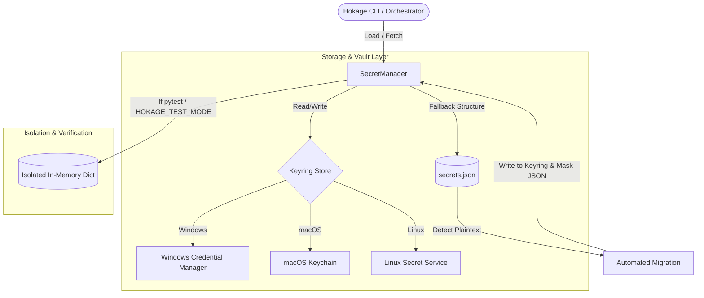

# Secrets Vault & Credential Security Layer Walkthrough

This document details the design, architecture, implementation, and verification of the Secrets Vault & Credential Security Layer in Hokage.

---

## 1. Architecture Overview

To transition Hokage into a secure, production-grade system, we have replaced the local plaintext storage of broker credentials with an OS-native secure credential store. The system integrates the Python `keyring` library to route secrets securely to the host operating system's canonical vault (e.g., Windows Credential Manager, macOS Keychain, or Linux Secret Service/pass).

### Architectural Components:
1. **SecretManager (`SecretManager`)**: The central engine that coordinates loading, setting, deleting, migrating, and rolling back secrets.
2. **OS-Native Keyring Integration**: Communicates with the platform-specific credential store using the `keyring` library. Keys are stored under the service name `"Hokage"` and the username format `f"{broker}:{key}"` (e.g., `zerodha:api_key`, `zerodha:access_token`).
3. **Controlled Migration Logic**: Automatically detects plaintext credentials in the user-local `secrets.json` file upon instantiation, writes them to the secure OS keyring, and replaces them on disk with `"MIGRATED_TO_KEYRING"` to eliminate plaintext secrets.
4. **Automated Rollback Strategy**: Provides an automated rollback path (`rollback_to_json()`) that retrieves all secure credentials from the OS keyring, writes them back to the user's local `secrets.json` file as plaintext, and purges them from the OS keyring.
5. **Test Environment Isolation**: Automatically detects test runs (e.g. under `pytest` or `HOKAGE_TEST_MODE=true`) and redirects all storage/retrieval operations to an isolated in-memory dictionary, preventing any modifications or reads of the user's real OS-native credentials during testing.

---

## 2. Keyring Keys & Multi-Broker Schema

To support future broker additions and multi-account configurations without design changes, credentials are stored in the keyring using a modular schema:
* **Service Name**: `"Hokage"`
* **Key/Username**: `f"{broker}:{credential_key}"`

### Example Mappings:
| Broker | Credential Key | Keyring Identifier | Secure Value |
| :--- | :--- | :--- | :--- |
| `zerodha` | `api_key` | `zerodha:api_key` | *Secret API Key* |
| `zerodha` | `api_secret` | `zerodha:api_secret` | *Secret API Secret* |
| `zerodha` | `access_token` | `zerodha:access_token` | *Secret Session Token* |
| `binance` | `api_key` | `binance:api_key` | *Future Binance API Key* |

---

## 3. CLI Commands

We have exposed a new set of subcommands under the `hokage secrets` namespace in the interactive shell:

* `hokage secrets`: Displays the current secure vault status, storage paths, test mode status, and a list of configured keys (with actual secret values safely masked).
* `hokage secrets set <key> <value> [<broker>]`: Securely writes a credential key-value pair to the vault for the specified broker (defaults to `"zerodha"`).
* `hokage secrets delete <key> [<broker>]`: Deletes a credential from the secure vault.
* `hokage secrets migrate`: Manually triggers the migration of any plaintext credentials in `secrets.json` to the secure keyring.
* `hokage secrets rollback`: Executes the rollback strategy, restoring all secure credentials back to the local `secrets.json` file in plaintext and clearing the OS keyring.

---

## 4. Files Added and Modified

### New Files Added:
* [test_secrets.py](file:///c:/Users/anant/OneDrive/Documents/AI%20PROJECT/AI%20COMMAND%20CENTRE/Hokage/tests/unit/integrations/test_secrets.py) — Comprehensive unit tests for `SecretManager` covering isolation, migration, rollback, and multi-broker support.
* [SECRETS_VAULT_WALKTHROUGH.md](file:///c:/Users/anant/OneDrive/Documents/AI%20PROJECT/AI%20COMMAND%20CENTRE/Hokage/SECRETS_VAULT_WALKTHROUGH.md) — Architectural walkthrough and documentation.

### Existing Files Modified:
* [pyproject.toml](file:///c:/Users/anant/OneDrive/Documents/AI%20PROJECT/AI%20COMMAND%20CENTRE/Hokage/pyproject.toml) — Added `keyring` as a dependency.
* [secrets.py](file:///c:/Users/anant/OneDrive/Documents/AI%20PROJECT/AI%20COMMAND%20CENTRE/Hokage/src/integrations/brokers/secrets.py) — Reimplemented `SecretManager` to integrate OS-native keyring storage, automated migration, rollback, and test isolation.
* [command_router.py](file:///c:/Users/anant/OneDrive/Documents/AI%20PROJECT/AI%20COMMAND%20CENTRE/Hokage/src/hokage/router/command_router.py) — Registered `hokage secrets` CLI commands, help documentation, and handlers.
* [test_cli_commands.py](file:///c:/Users/anant/OneDrive/Documents/AI%20PROJECT/AI%20COMMAND%20CENTRE/Hokage/tests/unit/bots/autonomous/test_cli_commands.py) — Added integration tests verifying all `hokage secrets` CLI subcommands.

---

## 5. Verification and Testing Summary

The unit and integration tests successfully cover:
1. `test_secret_manager_test_mode_isolation`: Asserts that test execution is isolated from the host OS keyring and runs inside a mock in-memory storage.
2. `test_secret_manager_migration`: Asserts that plaintext keys in the json template are migrated on start and written back as masked placeholders.
3. `test_secret_manager_rollback`: Asserts that rollback successfully writes all secrets back to the json file in plaintext and deletes them from the keyring.
4. `test_secret_manager_future_broker_support`: Asserts that credentials for different brokers (e.g. `zerodha` and `binance`) are stored independently under separate namespaces.
5. `test_secret_manager_load_secrets_fallback`: Asserts that `load_secrets()` resolves keyring values correctly while maintaining backward-compatible fallbacks.
6. `test_cli_secrets_commands`: Integration test verifying the CLI endpoints (`secrets`, `secrets set`, `secrets migrate`, `secrets rollback`) successfully route, execute, and mask output correctly.
