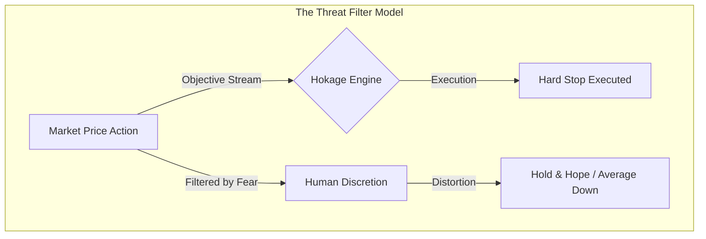

# Hokage Trading in the Zone Playbook
## Algorithmic Ingestion of Mark Douglas's Trading Psychology

This playbook translates the core trading psychology, risk management, and probabilistic decision-making principles from Mark Douglas's seminal work, *Trading in the Zone*, into actionable, institutional-grade architecture specifications for the Hokage trading bots. 

Rather than summarizing the book, this document establishes the mathematical rules, systemic boundaries, and logical gates designed to eliminate cognitive biases and automate disciplined, probabilistic execution across all Hokage bot layers.

---

## 1. Principles

The following core principles represent the foundational tenets of Mark Douglas's teachings, converted into systemic constraints for Hokage's fast-trading and deep-intelligence layers.

### [Principle 1] Probabilistic Edge Outcome Distribution
*   **Description:** For any given technical edge, there is a random and unpredictable distribution of individual wins and losses.
*   **Hokage Ingestion:** The bot must treat individual trade outcomes as statistical noise. The validation of any trading edge or strategy parameter cannot be adjusted or turned off based on short-term results. Strategy calibration and win-rate updates are restricted to evaluation blocks of $N \ge 30$ trades.
*   **Mathematical Concept:** 
    $$\lim_{N \to \infty} \frac{\sum_{i=1}^{N} \text{Outcome}_i}{N} = \text{Expectancy} \quad \text{where} \quad \text{Outcome}_i \in \{-\text{Risk}, \text{Reward}\}$$
    The sequence of individual outcomes is random, but the cumulative limit converges to a positive expectancy.

### [Principle 2] Independence of Individual Trade Outcomes
*   **Description:** The outcome of the current trade is mathematically independent of the previous trade's outcome or any future trade's outcome.
*   **Hokage Ingestion:** Consecutive losses must not scale down strategy confidence, and consecutive wins must not escalate conviction scores (precluding the "hot hand" fallacy). Sizing changes during drawdowns are governed strictly by preservation rules, never by recency bias.
*   **Mathematical Concept:**
    $$P(\text{Trade}_n = \text{Win} \mid \text{Trade}_{n-1} = \text{Loss}) = P(\text{Trade}_n = \text{Win})$$

### [Principle 3] Pre-defined Risk and Thesis Invalidation
*   **Description:** Risk must be fully defined, accepted, and locked prior to trade execution.
*   **Hokage Ingestion:** Every strategy proposal must contain an absolute, non-negotiable Stop Loss (SL) and Profit Target (PT) before entering the execution pipeline. If either is missing, or if the risk-to-reward ratio is sub-optimal, the trade is vetoed at the final gates.

### [Principle 4] Market Uniqueness and Non-Repeatability
*   **Description:** Every moment in the market is a unique event with a unique combination of active participants. Even if a pattern looks identical to a historical analog, the outcome can be entirely different.
*   **Hokage Ingestion:** The `HistoricalAnalogEngine` is treated as a weighting factor for conviction, never as a source of certainty. Historical analogs provide statistical contexts, but cannot override absolute risk caps or exposure limits.

### [Principle 5] Carefree Execution Flow (Systemic Discipline)
*   **Description:** Trading without fear, hesitation, or regret. This state of mind is achieved by accepting the risk completely, which eliminates the threat of market information.
*   **Hokage Ingestion:** Hokage removes human-in-the-loop discretion during live operations. Once a trade passes the 7-gate Investment Committee, order execution is fully automated and cannot be delayed, canceled, or manually adjusted by the user during the active session.

---

## 2. Mental Models

These decision-making frameworks govern how Hokage processes information, handles volatility, and evaluates its own performance.



### [Model 1] The Biased Coin (Probabilistic Edge Framework)
*   **Framework:** Conceptualizing the system's strategy as a coin with a $60\%$ probability of landing heads (wins), but where the order of heads and tails is completely random.
*   **Systemic Effect:** Ensures that the `PerformanceAnalyticsEngine` evaluates strategy success over rolling metrics rather than individual trade logs. It decouples trade-level disappointment from strategy-level performance.

### [Model 2] The Threat-Perception Filter
*   **Framework:** Humans perceive market data that contradicts their positions as "painful" and actively filter it out (e.g., ignoring a breakdown of a key moving average).
*   **Systemic Effect:** By delegating all data ingestion to `MarketScanner` and exit triggers to `RiskBot`, Hokage operates without a pain threshold. The system cannot filter out negative price feeds, preventing delayed exits or "hope-based" average-downs.

### [Model 3] The Cost of Doing Business (Loss Acceptance)
*   **Framework:** Treating a hit stop-loss not as a failure, error, or indictment of the bot's intelligence, but as an operational business expense (e.g., inventory costs or rent).
*   **Systemic Effect:** Standardizes stop execution. Slippage, commissions, and losses are compiled together under an `OperationalExpense` field in the `DecisionJournalSystem` to remove the psychological stigma of a losing trade.

### [Model 4] The Mechanical Stage of Competence
*   **Framework:** Restricting trading to strict, rule-bound parameters before allowing any adaptive scaling.
*   **Systemic Effect:** Hokage operates strictly in mechanical mode. Dynamic parameter overrides (e.g., switching to aggressive modes) are allowed only under strict, pre-calculated parameters generated by the `ElderTrustEngine`.

---

## 3. Rules

These machine-readable rules define how Hokage's risk and capital preservation engines enforce the *Trading in the Zone* doctrine.

### Rule 1: Immutable Predefined Risk (RM_001)
*   **Logic:** A trade proposal is invalid if the maximum risk is not predefined or exceeds the capital limit.
*   **Implementation Schema:**
```json
{
  "rule_id": "RM_001_IMMUTABLE_PREDEFINED_RISK",
  "scope": "Pre-Entry Gate",
  "assertions": {
    "stop_loss_defined": "proposal.stop_loss is not None",
    "target_price_defined": "proposal.target_price is not None",
    "risk_reward_ratio": "(proposal.target_price - proposal.entry_price) / (proposal.entry_price - proposal.stop_loss) >= 1.5"
  },
  "action_on_failure": "VETO_TRADE"
}
```

### Rule 2: Non-Discretionary Stop Enforcement (RM_002)
*   **Logic:** Once a position is live, the stop loss can only be adjusted to lock in profit (trailing stops). It can never be widened or canceled.
*   **Implementation Schema:**
```json
{
  "rule_id": "RM_002_STOP_LOSS_IMMUTABILITY",
  "scope": "Active Position Management",
  "assertions": {
    "proposed_stop_loss": "IF proposal.new_stop_loss is not None",
    "is_valid_adjustment": "IF position.direction == 'LONG' THEN proposal.new_stop_loss >= position.current_stop_loss ELSE proposal.new_stop_loss <= position.current_stop_loss"
  },
  "action_on_failure": "REJECT_MODIFICATION"
}
```

### Rule 3: Losing Streak Capital Decay (RM_003)
*   **Logic:** Protect the capital base from a random distribution of negative outcomes without changing the underlying strategy's technical edge.
*   **Implementation Schema:**
```python
def calculate_risk_multiplier(consecutive_losses: int) -> float:
    """
    Enforces Mark Douglas's concept of capital preservation during
    unfavorable probability distributions.
    """
    if consecutive_losses == 0:
        return 1.0
    elif consecutive_losses in [1, 2]:
        return 1.0  # Allow edge to play out
    elif consecutive_losses in [3, 4]:
        return 0.5  # Scale down exposure
    elif consecutive_losses >= 5:
        return 0.2  # Max preservation mode
    return 1.0
```

### Rule 4: Anti-Averaging-Down Guard (RM_004)
*   **Logic:** Averaging down is a manifestation of the refusal to accept a loss. It violates the predefined risk limit.
*   **Implementation Schema:**
```json
{
  "rule_id": "RM_004_ANTI_AVERAGING_DOWN",
  "scope": "Opportunity Discovery & Allocation",
  "assertions": {
    "existing_position_loss": "IF portfolio.has_position(symbol) AND portfolio.get_unrealized_pnl(symbol) < 0",
    "allow_additional_entry": "False"
  },
  "action_on_failure": "VETO_ORDER"
}
```

---

## 4. Anti-Patterns

Hokage systematically monitors, flags, and blocks these psychological anti-patterns through its automated gates.

```
       PSYCHOLOGICAL ANTI-PATTERNS vs HOKAGE AUTOMATED MITIGATION

[ Human Trader Pitfall ]                [ Hokage System Safeguard ]
┌─────────────────────────┐             ┌─────────────────────────┐
│ Fear of Being Wrong     │  ─────────> │ Immutable Exits         │
│ (Widens/cancels stops)  │             │ (RiskBot hard triggers) │
└─────────────────────────┘             └─────────────────────────┘
┌─────────────────────────┐             ┌─────────────────────────┐
│ Revenge Trading         │  ─────────> │ Cooling-Off Timer       │
│ (Retaliates after loss) │             │ (Cooldown Gate)         │
└─────────────────────────┘             └─────────────────────────┘
┌─────────────────────────┐             ┌─────────────────────────┐
│ FOMO (Fear of Missing)  │  ─────────> │ Slippage Cap            │
│ (Chasing breakouts late)│             │ (Max Entry Slippage Pct)│
└─────────────────────────┘             └─────────────────────────┘
┌─────────────────────────┐             ┌─────────────────────────┐
│ Overconfidence          │  ─────────> │ Sizing Hard Cap         │
│ (Over-sizing on wins)   │             │ (Equity-only scaling)   │
└─────────────────────────┘             └─────────────────────────┘
```

### 1. Fear of Being Wrong (Thesis Lock-In)
*   **Behavioral Pattern:** Holding a position past invalidation because admitting a loss causes cognitive pain.
*   **Hokage Detection:** Price crosses stop-loss threshold while exit order is not executed or is modified/canceled.
*   **System Action:** `RiskBot` runs hard stop triggers. If a manual kite cancellation occurs, the system triggers a market emergency sell order (`BaseExecutionVenue.emergency_close`) and puts the bot in `NO_TRADE` mode.

### 2. Greed (Dynamic Target Escalation)
*   **Behavioral Pattern:** Moving the profit target further away as the price approaches it without technical justification, often leading to a reversal that wipes out gains.
*   **Hokage Detection:** Target price modified upwards by > 1% in an active trade without a corresponding change in the underlying indicator trend or regime shift.
*   **System Action:** `NoTradeDecisionEngine` locks targets. Adjustments are only allowed if guided by mechanical trailing-stop logic (e.g., ATR-based trail).

### 3. FOMO (Fear Of Missing Out / Chasing)
*   **Behavioral Pattern:** Entering a trade late because of the pain of missing the initial entry signal.
*   **Hokage Detection:** The current asset price is significantly higher than the trigger price calculated at discovery time.
*   **System Action:** The `NoTradeDecisionEngine` triggers a `FOMO_CHASE_VETO` if:
    $$\text{Current Price} > \text{Trigger Price} \times (1 + \text{Max Chase Limit})$$
    where $\text{Max Chase Limit}$ is configured at $1.5\%$ of the ATR.

### 4. Revenge Trading (Loss Retaliation)
*   **Behavioral Pattern:** Entering another trade immediately after a loss to recover the deficit, often with increased size and lower criteria.
*   **Hokage Detection:** System tries to enter a trade within the configured cooldown interval of a symbol that was recently closed as a loss.
*   **System Action:** `CapitalPreservationEngine` enforces a 60-minute cooling-off block on that sector, and a 120-minute cooling-off block on the specific symbol.

### 5. Overconfidence (Streak Expansion)
*   **Behavioral Pattern:** Scaling up allocations and easing selection criteria because of a recent winning streak.
*   **Hokage Detection:** Sizing multipliers scaled up beyond parameters justified by the capital base.
*   **System Action:** `PositionAllocationEngine` limits sizing scaling to the `CapitalPreservationEngine` multipliers. Winning streaks do not increase position sizing beyond the baseline max exposure cap ($5\%$ of total equity).

### 6. Loss Aversion (Loss Realization Delay)
*   **Behavioral Pattern:** Refusing to close positions at loss because of the emotional pain of booking it, hoping it will return to breakeven.
*   **Hokage Detection:** Positions hitting stop-loss parameters remaining open.
*   **System Action:** Objective exit sweep executes every 5 seconds. If venue latency causes delays, the bot sends alerts to disconnect the API and triggers emergency exit commands.

---

## 5. Decision Frameworks

These programmatic gates guide Hokage's trade review process, validating every opportunity against a series of criteria before allocating capital.

### Framework 1: Probabilistic Calibration Flow
When the `StrategyBot` discovers a pattern, Hokage evaluates it through the **Confidence Calibration Engine** to convert the conviction score into a probabilistic distribution rather than a deterministic conviction.

```
       [ Opportunity Discovered ]
                   │
                   ▼
       [ ConvictionScoreEngine ]
      - Calculates Edge Match (0-100)
                   │
                   ▼
  [ ConfidenceCalibrationEngine ]
  - Adjusts for recent regime outcomes
  - Calculates Expected Value (EV)
                   │
                   ▼
       [ Is Expected Value > 0? ]
          ├── NO  ──> [ Log & Discard ]
          └── YES ──> [ Proceed to Portfolio Aware Engine ]
```

$$EV = (\text{Calibrated Probability of Win} \times \text{Average Win}) - ((1 - \text{Calibrated Probability of Win}) \times \text{Average Loss})$$

Execution is only permitted if $EV > 0$.

### Framework 2: The 7-Gate Investment Committee Execution Pipeline
Before an order is sent to the venue, it must pass through all 7 gates. If any gate fails or returns a veto, the decision is logged in the `decision_journal.jsonl` and aborted.

1.  **Gate 1: Capital Preservation Gate**
    *   *Checks:* Are we in `NO_TRADE`, `DEFENSIVE`, or `RECOVERY` mode? Has the daily drawdown cap been breached?
    *   *Rule:* If daily drawdown > $2\%$, veto.
2.  **Gate 2: Portfolio Awareness Gate**
    *   *Checks:* Does this trade exceed sector limits or asset class exposure caps?
    *   *Rule:* Sector exposure must remain $< 25\%$ of total equity.
3.  **Gate 3: Conviction Score Gate**
    *   *Checks:* Does the trade meet the conviction threshold for the active personality mode?
    *   *Rule:* If Mode == `DEFENSIVE` and Conviction < $75$, veto.
4.  **Gate 4: Confidence Calibration Gate**
    *   *Checks:* Scales the conviction score based on recent performance calibration data.
5.  **Gate 5: No-Trade Veto Gate**
    *   *Checks:* Checks for FOMO chasing, regime mismatch, or high geopolitical risk indices.
6.  **Gate 6: Position Allocation Gate**
    *   *Checks:* Computes the position size, scaling down by the Elder Trust risk multiplier and losing streak factor.
7.  **Gate 7: Risk Validation Gate**
    *   *Checks:* Verifies the stop-loss price and risk limits are locked.
    *   *Rule:* Target R:R must be $\ge 1.5$.

---

## 6. Integration Notes

This matrix maps each principle, model, and rule to the specific files, bots, and systems within the Hokage architecture.

| Concept / Rule | Hokage File Location | Target Bot / Engine | Systems Affected |
| :--- | :--- | :--- | :--- |
| **Principle 1: Probabilistic Edge** | `src/bots/autonomous/performance_analytics.py` | `PerformanceAnalyticsEngine` | Conviction, Position Management |
| **Principle 2: Outcome Independence** | `src/bots/autonomous/conviction.py` | `ConfidenceCalibrationEngine` | Conviction |
| **Principle 3: Predefined Risk** | `src/bots/autonomous/capital_preservation.py` | `CapitalPreservationEngine` | Risk, Capital Preservation |
| **Principle 4: Market Uniqueness** | `src/bots/autonomous/analogs.py` | `HistoricalAnalogEngine` | Conviction |
| **Principle 5: Carefree Flow** | `src/bots/autonomous/autonomous_bot.py` | `AutonomousTradingBot` | Position Management |
| **Model 1: Biased Coin** | `src/bots/autonomous/decision_journal.py` | `DecisionJournalSystem` | Position Management |
| **Model 2: Threat Perception** | `src/bots/autonomous/autonomous_bot.py` | `AutonomousTradingBot` | Risk, Position Management |
| **Model 3: Operational Expense** | `src/bots/autonomous/decision_journal.py` | `DecisionJournalSystem` | Capital Preservation, Position Management |
| **Model 4: Mechanical Stage** | `src/bots/autonomous/personality_engine.py` | `PortfolioManagerPersonalityLayer` | Conviction, Allocation |
| **Rule 1: Predefined Risk (RM_001)** | `src/bots/risk/rules.py` | `RiskRules` | Risk, Capital Preservation |
| **Rule 2: Stop Loss Lock (RM_002)** | `src/bots/risk/risk_bot.py` | `RiskBot` | Risk, Position Management |
| **Rule 3: Losing Streak Scaling (RM_003)**| `src/bots/autonomous/capital_preservation.py`| `CapitalPreservationEngine` | Allocation, Capital Preservation |
| **Rule 4: Anti-Averaging (RM_004)** | `src/bots/autonomous/conviction.py` | `NoTradeDecisionEngine` | Conviction, Allocation |
| **Anti-Pattern 1: Fear of Being Wrong**| `src/bots/risk/risk_bot.py` | `RiskBot` | Risk, Position Management |
| **Anti-Pattern 2: Greed (Target Chasing)**| `src/bots/autonomous/conviction.py` | `NoTradeDecisionEngine` | Position Management |
| **Anti-Pattern 3: FOMO (Chasing)** | `src/bots/autonomous/conviction.py` | `NoTradeDecisionEngine` | Conviction |
| **Anti-Pattern 4: Revenge Trading** | `src/bots/autonomous/capital_preservation.py`| `CapitalPreservationEngine` | Capital Preservation, Allocation |
| **Anti-Pattern 5: Overconfidence** | `src/bots/autonomous/trust_engine.py` | `ElderTrustEngine` | Conviction, Allocation |
| **Anti-Pattern 6: Loss Aversion** | `src/bots/risk/risk_bot.py` | `RiskBot` | Risk, Position Management |
