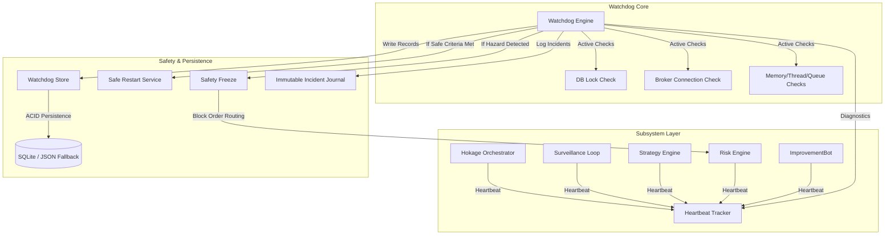

# Watchdog & Heartbeat Monitoring System Walkthrough

This document details the design, architecture, implementation, and verification of Phase 6.3 — Watchdog & Heartbeat Monitoring in Hokage.

---

## 1. Architecture Overview

To ensure absolute operational resilience and prevent financial losses, we have implemented a production-grade **Watchdog & Heartbeat Monitoring System**. The system independently tracks the health of all core subsystems, runs periodic diagnostics, maintains an immutable incident journal, and enforces a strict safe restart policy.

### Architectural Components:
1. **Heartbeat Tracker (`HeartbeatTracker`)**: A thread-safe publisher/registry that captures point-in-time metrics from all active subsystems, including status, uptime, execution latency, memory usage, and CPU usage.
2. **Watchdog Engine (`Watchdog`)**: The main coordinator executing diagnostic routines. It monitors database locks, thread counts, memory leaks, event loop stalls, broker connectivity, and heartbeat freshness.
3. **Immutable Incident Journal (`IncidentJournal`)**: Records failure events as immutable records (`Incident`) containing severity, root cause, automatic actions, and recommended actions. Incidents are never deleted.
4. **Safety Gating**: If a hazard is detected (e.g. database locked, broker disconnected), the Watchdog triggers a safety freeze to block all order routing and preserve capital.
5. **Safe Restart Policy**: Automatically restarts background loops only when all safety criteria are met (no live orders, no active reconciliation, no open transactions, consistent broker session). Otherwise, it alerts the Commander and waits.

---

## 2. Failure Detection & Severity Levels

The Watchdog classifies operational anomalies into five distinct severity levels:

| Severity | Description / Cause | Automatic Watchdog Action |
| :--- | :--- | :--- |
| **INFO** | Normal system events, registrations, or resolutions. | Logs event; records status. |
| **WARNING** | Stale heartbeat (> 30s), elevated memory (> 350MB), or high thread count (> 30). | Logs warning; captures diagnostics. |
| **HIGH** | Multiple stale heartbeats or broker connectivity lost. | Activates safety freeze; blocks new trades on the broker. |
| **CRITICAL** | Database locked/corrupt, event loop stalled, or failed restart attempt. | Activates safety freeze; triggers alert; blocks all orders. |
| **FATAL** | Total orchestrator failure or severe system corruption. | Locks down all operations; alerts Commander; shuts down loop. |

---

## 3. Safe Restart Policy

To prevent executing restarts during active trades or database writes, background service restarts are gated by four strict criteria:

1. **No Live Order In Progress**: Verifies that no trades are in `SUBMITTED` or unfinalized states.
2. **No Active Reconciliation**: Verifies that no reconciliation runs or difference engine comparisons are executing.
3. **Database Transaction Complete**: Verifies that the SQLite database is not currently inside a write transaction (`conn.in_transaction is False`).
4. **Broker Session Consistent**: Verifies that the broker connection is in a stable state (`CONNECTED` or `DISCONNECTED`), not in transition.

If any criterion is violated, the restart is blocked, a **CRITICAL** incident is logged, and the system waits for manual Commander intervention.

---

## 4. CLI Commands

We have added a new set of commands under the `hokage watchdog` namespace:

* `hokage watchdog status`: Runs active diagnostics across all subsystems, calculates the overall health score, and prints a status matrix.
* `hokage watchdog heartbeat`: Displays the latest heartbeat metrics (status, uptime, latency, memory) for all active subsystems.
* `hokage watchdog incidents`: Lists all historical incidents in the journal (from newest to oldest).
* `hokage watchdog incidents ack <incident_id>`: Allows the Commander to acknowledge a specific incident by its unique ID.
* `hokage watchdog restart <subsystem>`: Manually triggers a safe background restart for the specified subsystem.

---

## 5. REST API Endpoints

We have exposed the following REST endpoints in the Flask dashboard server (`/api/v1`):

* `GET /api/v1/watchdog/status`: Returns a JSON summary of the overall health score, active incidents, and restart counts.
* `GET /api/v1/watchdog/heartbeats`: Returns a JSON list of the latest heartbeat metrics for all subsystems.
* `GET /api/v1/watchdog/incidents`: Returns a JSON list of all recorded incidents in the journal.
* `POST /api/v1/watchdog/incidents/acknowledge/<incident_id>`: Acknowledges a specific incident.
* `POST /api/v1/watchdog/restart/<subsystem>`: Manually triggers a safe subsystem restart.

---

## 6. Files Added and Modified

### New Files Added:
* `src/shared/watchdog/heartbeat.py` (Subsystem Heartbeat and HeartbeatTracker models).
* `src/shared/watchdog/incident.py` (Incident and IncidentJournal models).
* `src/shared/watchdog/store.py` (Watchdog database and JSON fallback persistence).
* `src/shared/watchdog/watchdog.py` (Watchdog monitoring and safe restart engine).
* `src/shared/watchdog/__init__.py` (Package public interface exports).
* `tests/unit/shared/watchdog/test_watchdog.py` (Comprehensive unit and integration test suite).
* `WATCHDOG_HEARTBEAT_WALKTHROUGH.md` (System architectural walkthrough and documentation).

### Existing Files Modified:
* `pyproject.toml` (Added `psutil` dependency).
* `src/shared/persistence/sqlite_engine.py` (Registered DDL tables `watchdog_heartbeats` and `watchdog_incidents`).
* `src/hokage/orchestrator/pipeline.py` (Initialized `Watchdog` in orchestrator and added heartbeat/diagnostic query methods).
* `src/hokage/router/command_router.py` (Added `hokage watchdog` CLI commands and handlers).
* `src/hokage/dashboard/api.py` (Registered Flask dashboard REST endpoints).
* `PROJECT_STATE.md` (Updated test results and milestone logs).
* `Memory.md` (Documented Phase 6.3 completion and architectural facts).

---

## 7. Verification and Testing Summary

The test suite covers:
1. **Heartbeat Publishing**: Asserts that heartbeats capture CPU, memory, uptime, and latency, and are saved securely.
2. **Incident Immutability**: Asserts that incidents generate unique IDs and are never deleted.
3. **Failure Detection (Stale Heartbeats)**: Asserts that heartbeats older than 30s are flagged and recorded as incidents.
4. **Database Lock Check**: Asserts that database transaction failures are detected and activate safety freezes.
5. **Memory Leak Protection**: Asserts that memory exceeding critical thresholds triggers critical incidents and runs diagnostic garbage collection.
6. **Safe Restart Policy**: Asserts that restarts succeed and clear stale heartbeats if safety criteria are met.
7. **Restart Denial**: Asserts that restarts are blocked and critical incidents are raised if active orders or transactions are pending.
8. **Commander Acknowledgements**: Asserts that incidents can be acknowledged and resolved with duration tracking.
9. **Concurrency Stress Testing**: Asserts thread-safe parallel writes of heartbeats and incidents under high parallel load.
