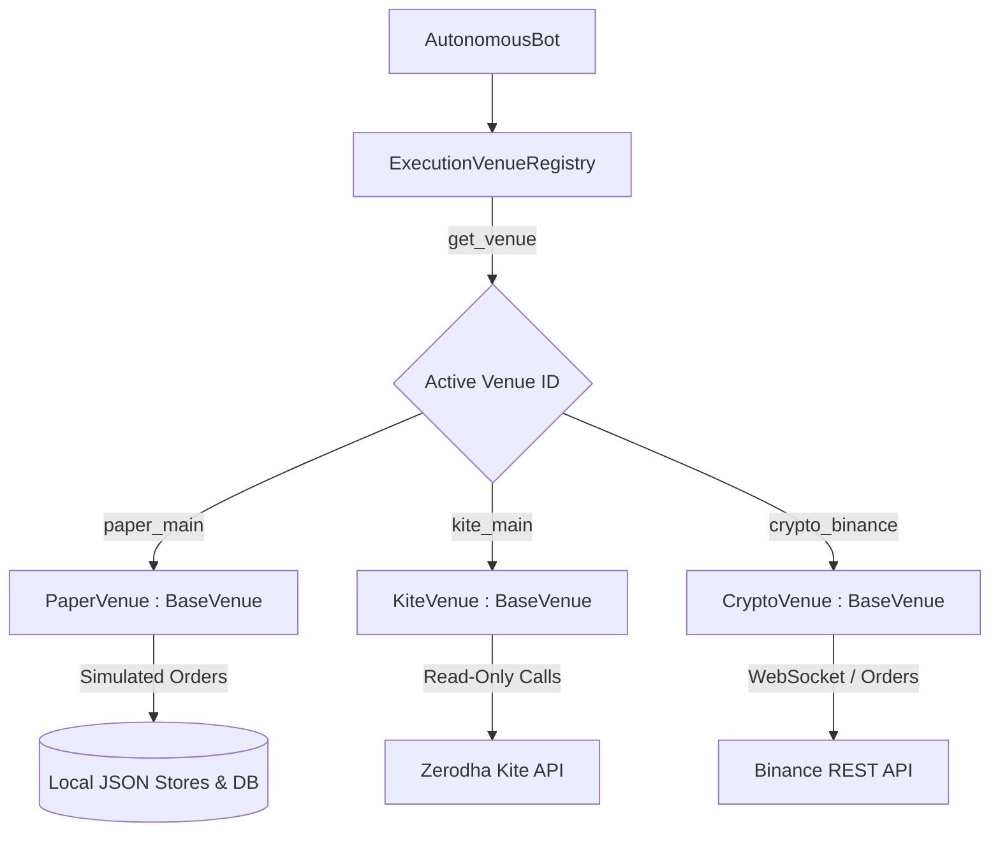
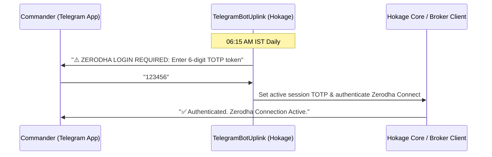
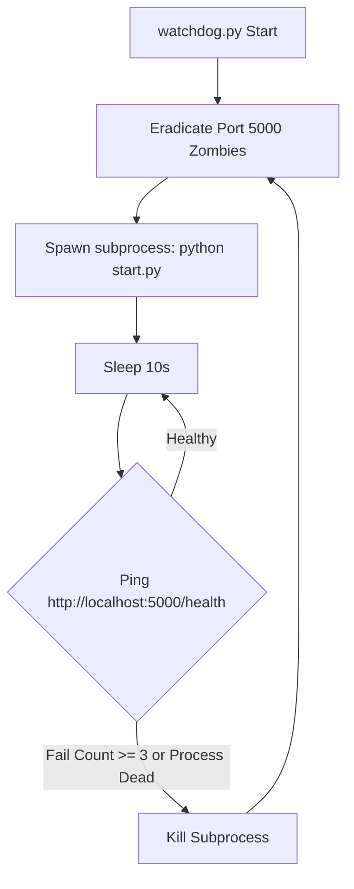

# Hokage Architecture Document: HNEP Phase 1 (The Cross-Asset Fortress)

This document outlines the design, data flows, and integration details of the newly introduced HNEP Phase 1 architectural upgrades: the Unified Broker Interface, the Telegram Commander Uplink, and the Watchdog Supervisor.

---

## 1. Unified Broker Interface

To support multi-asset class trading (Indian Equities, Crypto, Forex) seamlessly, the execution flow is decoupled from broker-specific API implementations.

### Class Architecture

- **`BaseVenue` (Abstract Base Class)**: Defines the standard operations that every custodian or execution venue must support:
  - `venue_id` (Identifier)
  - `capabilities` (Supported order types, websocket availability, margin support, options, futures)
  - `connect()`, `disconnect()`, `get_status()`
  - `place_order()`, `cancel_order()`, `get_order_status()`
  - `get_account_balance()`, `get_positions()`, `get_holdings()`
- **`BaseExecutionVenue` (Protocol)**: Inherits from `BaseVenue` and acts as a runtime checkable Protocol for type-checking and dependency injection.
- **Adapters**:
  - `PaperVenue`: Simulates order placement, tax recording, and portfolio updates locally using `ExecutionBot` and `PaperEngine`.
  - `KiteVenue` (Zerodha): Provides read-only data access with broker-level safety locks that prevent any active write operations unless explicitly running in Live mode.
  - Future venues (e.g., Binance for Crypto, Oanda for Forex) inherit from `BaseVenue` and plug directly into the `ExecutionVenueRegistry`.

### Data Flow Diagram

---

## 2. Telegram Commander Uplink

The Telegram Uplink provides a secure notification channel and interactive session-level authorization.

### Data Flow & Protocols

1. **Daily TOTP Authentication**:
   - Exactly at **06:15 AM IST (Kolkata Time)**, the Telegram loop wakes up and sends a notification asking for the 6-digit Zerodha TOTP token.
   - The user replies to the Telegram bot with the 6-digit numeric token.
   - The Telegram polling loop intercepts the code, validates it, and caches it as the active session TOTP.
   - The system utilizes this TOTP code to establish a fresh, authenticated connection with the Zerodha servers.
2. **Real-time Trade Alerts**:
   - Whenever an order is executed (entry fill or stop-loss/take-profit exit), a payload is sent to `TelegramBotUplink`.
   - The uplink formats a Markdown alert detailing the asset, side, quantity, and execution price, pushing it to the user.
3. **EOD Summaries**:
   - At the market close, a P&L recap (Realized P&L, Unrealized P&L, Total Equity, and trades count) is sent to the user's Telegram.

---

## 3. Watchdog Process Supervisor

To guarantee 100% uptime and eliminate zombie Python processes holding port 5000, a parent-level supervisor process is run.

### Health Check and Auto-Recovery Loop

1. **Start Sequence**:
   - `watchdog.py` is invoked at the root directory.
   - It performs an initial aggressive scan using `psutil` and `kill_port_5000.ps1` to destroy any existing processes holding port 5000.
   - It spawns `python start.py` as a subprocess.
2. **Periodic Checks**:
   - Every 10 seconds, the watchdog requests `/api/v1/health` and `/api/v1/watchdog/status` on port 5000.
   - It verifies if the subprocess is still alive.
3. **Recovery Protocol**:
   - If the endpoint fails to respond 3 consecutive times or times out, the watchdog terminates/kills the subprocess.
   - It executes `kill_port_5000.ps1` and runs direct OS-level connection kills via `psutil` to guarantee port 5000 is fully cleared.
   - It spawns a new instance of `start.py`.

---

## 4. HNEP Phase 3: The Autonomous Brain & Time Actions

Phase 3 introduces temporal management and hardcoded self-governance capabilities for the autonomous core.

### 06:00 AM Free Mind Reset
To guarantee Hokage remains objective and completely free of residual manual states, a `CronScheduler` background daemon executes a daily state flush exactly at 06:00 AM IST.
- Wipes `intraday_override`.
- Clears daily trading counts (`_trades_taken_today`, `_exits_executed_today`).
- Restores `free_mind_free_hand` to `True`.
- Secured via standard threading locks to prevent execution race conditions across async data feeds.

### Venue-Aware Morning Observation Gate
Between **09:15 AM and 09:30 AM IST**, the bot enters a strict **Observation Gate** to establish baseline microstructure logic (Cumulative Volume Delta mapping).
- **Opening Auction Exchanges (NSE/BSE)**: Trade entry execution is hard-blocked. Hokage consumes live websockets passively to map the opening horizontal ranges.
- **Continuous Feeds (Crypto/Forex)**: The gate is intentionally bypassed to respect the 24/7 continuous rolling window nature of these venues.

---

## 5. HNEP Phase 4: Risk & Capital Management

Phase 4 formalizes dynamic risk scaling and introduces the Adaptive Exit Ladder to enforce capital preservation without manual oversight.

### Adaptive Exit Ladder
Inside `autonomous_bot.py`, an aggressive cascading hierarchy strictly evaluates every active position in the following priority:
1. **Manual Kill Switch**: Instant liquidation if intraday override is set to `KILL`.
2. **Time-Based Square-Off**: Automatic EOD exit (15:20 IST for Equities, 23:15 IST for Commodities). Crypto operates on a continuous 24/7 rolling window without time-based interruption.
3. **Hard Backstop**: A fixed maximum rupee loss floor (e.g., ₹5,000) overriding all algorithmic targets.
4. **ATR Thesis Stop**: Dynamic invalidation if the underlying asset moves **1.25x ATR** against the structured entry price.
5. **Trailing Lock**: Incremental Trailing Stop-Loss lock-ins based on peak pricing.

### Time-Decaying Profit Targets
Profit targets are dynamically compressed as the session nears its close:
`TGT = Entry ± [0.5 * ATR * sqrt(Bars_Left_In_Session)]`
This ensures Hokage secures available Alpha before the time-based square-off triggers a market exit.

### Dynamic Kelly Criterion Sizing
Static lot-sizing has been replaced by probability-weighted bet sizing. The LLM processor's synthesis confidence score (0-100) is normalized into the primary probability input ($p$) for the Kelly Criterion formula:
$f^* = p - \frac{1-p}{b}$
A conservative baseline risk/reward ($b = 1.5$) is assumed, and the resulting fraction is capped at 5% of total equity to prevent extreme leverage on isolated high-confidence triggers.

---

## 6. HNEP Phase 5: Hyper-Evolution & Macro Intelligence

Phase 5 formalizes the ultimate autonomous layer: continuous learning, macro-awareness, and strictly purged backtesting.

### Immutable Execution Ledger
The `trade_ledger.py` SQLite engine strictly logs all execution parameters (Entry, Exit, Slippage, R:R, LLM Confidence). This acts as the unalterable ground truth for the Midnight Crucible.

### Geopolitical Macro Ingestor & Anbu Dispatch
The `MacroIngestor` (`macro_ingestor.py`) constantly polls global NLP-assessed news feeds for Black Swan events (war, pandemic, collapse). 
- If a severe event is detected, Kelly sizing is instantly halved, and long exposures are discouraged.
- The **Anbu Intel Dispatch** logic immediately pushes a hardcoded `🚨 ANBU INTEL DISPATCH 🚨` alert via the Telegram Bot summarizing the event and Hokage's structural reaction.

### The Midnight Crucible
- `midnight_crucible.py` triggers at 23:30 IST to evaluate the immutable execution ledger and score the AI's daily alpha logic, simulating real-time weight adjustments (reinforcement).
